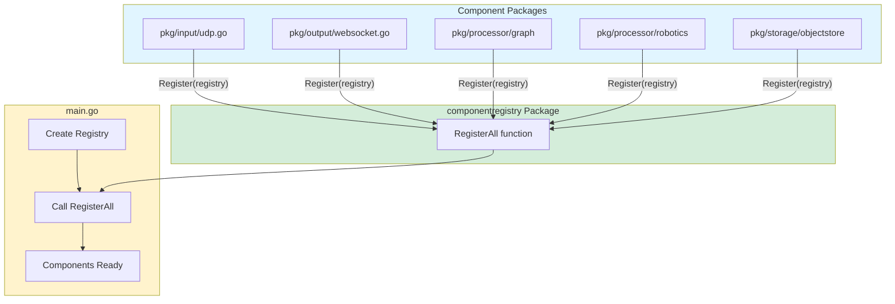
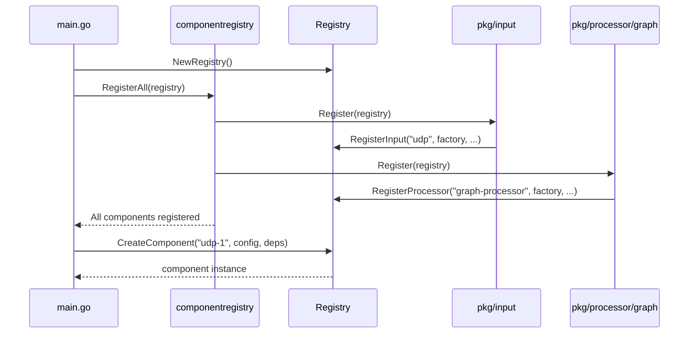

# Component Package

core component infrastructure for SemStreams, providing registration, discovery, lifecycle management, and instance creation with explicit registration patterns.

## Overview

The component package defines the fundamental abstractions for all SemStreams components, enabling dynamic discovery, registration, and management of input, processor, output, and storage components. This package follows explicit registration patterns with dependency injection through structured configuration.

Components in SemStreams are self-describing units that can be discovered at runtime, configured through schemas, and managed through their lifecycle. The package supports four types of components: inputs (data sources), processors (data transformers), outputs (data sinks), and storage (persistence).

The Registry serves as the central component management system, handling both factory registration and instance management with thread-safe operations and proper lifecycle control.

## Installation

```go
import "github.com/c360/semstreams/component"
```

## Architecture

### Component Registration Flow

SemStreams uses **EXPLICIT registration** rather than init() self-registration:



### Registration Pattern

Each component package exports a `Register()` function:



### Why Explicit Registration?

| Aspect | init() Self-Registration | Explicit Registration |
|--------|-------------------------|----------------------|
| **Testability** | ❌ Global state, hard to isolate | ✅ Create isolated test registries |
| **Explicitness** | ❌ Hidden dependencies via imports | ✅ Clear dependency graph |
| **Control** | ❌ Automatic on import | ✅ Application controls what/when |
| **Side Effects** | ❌ Package import modifies globals | ✅ No side effects from imports |
| **Debugging** | ❌ Registration order unclear | ✅ Deterministic, explicit order |

### FlowGraph Component

The FlowGraph component (`flowgraph/`) provides **static analysis and validation** of component interconnections. It is used by the flow engine's validator to analyze flow definitions before deployment.

**Purpose**: Build and validate connectivity graphs from component port definitions

**Key Responsibilities**:
- Build connectivity graphs from component port definitions
- Auto-discover connections via pattern matching (NATS subjects, KV buckets)
- Detect orphaned ports and disconnected components
- Validate interface contracts between connected ports
- Identify resource conflicts (e.g., network port binding)

**Important**: FlowGraph is a **validation tool**, not a runtime component. It creates temporary graph structures for analysis during flow validation and is discarded after validation completes. The flow engine uses FlowGraph during pre-deployment validation but does not use it during runtime execution.

**Relationship to Flow Infrastructure**:

```
Flow Service (HTTP API)
    ↓ uses
Flow Engine (Lifecycle Orchestration)
    ↓ validation → FlowGraph (Static Analysis)
    ↓ deployment → Component Manager (Runtime)
```

- **FlowGraph**: "Can these components connect?" (static graph analysis)
- **Flow Engine**: "Deploy/start/stop this flow" (lifecycle orchestration)
- **Flow Service**: "HTTP interface to flow operations" (REST API layer)

Each layer has distinct, non-overlapping responsibilities.

## Quick Start

### Basic Usage

```go
package main

import (
    "encoding/json"
    "log"

    "github.com/c360/semstreams/component"
    "github.com/c360/semstreams/componentregistry"
    "github.com/c360/semstreams/types"
)

func main() {
    // Create registry and register all components
    registry := component.NewRegistry()
    if err := componentregistry.RegisterAll(registry); err != nil {
        log.Fatal(err)
    }

    // Create component configuration
    config := types.ComponentConfig{
        Type:    types.ComponentTypeInput,
        Name:    "udp",
        Enabled: true,
        Config:  json.RawMessage(`{"port": 8080, "bind": "0.0.0.0"}`),
    }

    // Prepare dependencies
    deps := component.Dependencies{
        NATSClient: natsClient,
        Platform: component.PlatformMeta{
            Org:      "c360",
            Platform: "platform1",
        },
        Logger: slog.Default(),
    }

    // Create component instance
    instance, err := registry.CreateComponent("udp-input-1", config, deps)
    if err != nil {
        log.Fatal(err)
    }

    // Component is ready to use
    log.Printf("Created: %s", instance.Meta().Name)
}
```

### Implementing a Component

```go
package mycomponent

import (
    "encoding/json"

    "github.com/c360/semstreams/component"
)

// Component implementation
type MyInput struct {
    config MyConfig
    deps   component.Dependencies
}

func (m *MyInput) Meta() component.Metadata {
    return component.Metadata{
        Name:        "my-input",
        Type:        "input",
        Description: "My custom input component",
        Version:     "1.0.0",
    }
}

func (m *MyInput) InputPorts() []component.Port { return nil }

func (m *MyInput) OutputPorts() []component.Port {
    return []component.Port{
        {
            Name:      "output",
            Direction: component.DirectionOutput,
            Required:  true,
            Config:    component.NATSPort{Subject: "my.output"},
        },
    }
}

func (m *MyInput) ConfigSchema() component.ConfigSchema {
    return component.ConfigSchema{
        Properties: map[string]component.PropertySchema{
            "interval": {Type: "duration", Description: "Poll interval"},
        },
    }
}

func (m *MyInput) Health() component.HealthStatus {
    return component.HealthStatus{Healthy: true}
}

func (m *MyInput) DataFlow() component.FlowMetrics {
    return component.FlowMetrics{}
}

// Factory function
func CreateMyInput(rawConfig json.RawMessage, deps component.Dependencies) (component.Discoverable, error) {
    var config MyConfig
    if err := json.Unmarshal(rawConfig, &config); err != nil {
        return nil, err
    }

    return &MyInput{
        config: config,
        deps:   deps,
    }, nil
}

// IMPORTANT: Export Register() function, NOT init()
func Register(registry *component.Registry) error {
    return registry.RegisterWithConfig(component.RegistrationConfig{
        Name:        "my-input",
        Factory:     CreateMyInput,
        Schema:      myInputSchema,
        Type:        "input",
        Protocol:    "custom",
        Domain:      "network",
        Description: "My custom input component",
        Version:     "1.0.0",
    })
}
```

Then add to `pkg/componentregistry/register.go`:

```go
import "github.com/yourorg/semstreams/pkg/mycomponent"

func registercore (registry *component.Registry) error {
    // ... existing registrations

    if err := mycomponent.Register(registry); err != nil {
        return err
    }

    return nil
}
```

## core Concepts

### Discoverable Interface

Every component must implement:

```go
type Discoverable interface {
    Meta() Metadata                  // Component metadata
    InputPorts() []Port              // Input port definitions
    OutputPorts() []Port             // Output port definitions
    ConfigSchema() ConfigSchema      // Configuration schema
    Health() HealthStatus            // Current health status
    DataFlow() FlowMetrics          // Data flow metrics
}
```

### Dependencies

Dependency injection structure:

```go
type Dependencies struct {
    NATSClient      *natsclient.Client      // Required: messaging
    ObjectStore     ObjectStore             // Optional: persistence
    MetricsRegistry *metric.MetricsRegistry // Optional: Prometheus
    Logger          *slog.Logger            // Optional: logging
    Platform        PlatformMeta            // Required: identity
}
```

### Port Types

Components declare ports using strongly-typed configurations:

```go
// NATS Pub/Sub
component.NATSPort{Subject: "data.output"}

// JetStream durable streaming
component.JetStreamPort{Stream: "EVENTS", Subject: "events.>"}

// KV bucket watch
component.KVWatchPort{Bucket: "CONFIG", Keys: []string{"app.*"}}

// KV bucket write
component.KVWritePort{
    Bucket: "ENTITY_STATES",
    Interface: &component.InterfaceContract{
        Type:    "graph.EntityState",
        Version: "v1",
    },
}

// Network binding
component.NetworkPort{Protocol: "udp", Port: 14550, Bind: "0.0.0.0"}
```

## API Reference

### Registry

#### `NewRegistry() *Registry`

Creates a new Registry with initialized maps.

#### `CreateComponent(instanceName string, config types.ComponentConfig, deps Dependencies) (Discoverable, error)`

Creates a component instance from registered factory.

#### `RegisterInput(name string, factory Factory, protocol, description, version string) error`

Registers an input component factory.

#### `RegisterProcessor(name string, factory Factory, protocol, description, version string) error`

Registers a processor component factory.

#### `RegisterOutput(name string, factory Factory, protocol, description, version string) error`

Registers an output component factory.

#### `RegisterStorage(name string, factory Factory, protocol, description, version string) error`

Registers a storage component factory.

#### `ListAvailable() map[string]Info`

Returns metadata for all registered factories.

#### `ListComponents() map[string]Discoverable`

Returns all created component instances.

### Types

#### `Factory`

```go
type Factory func(rawConfig json.RawMessage, deps Dependencies) (Discoverable, error)
```

Factory function signature for component creation.

## Error Handling

### Error Types

```go
ErrFactoryAlreadyExists // Duplicate factory registration
ErrInvalidFactory       // Invalid factory registration
ErrFactoryNotFound      // Unknown factory name
ErrComponentCreation    // Factory execution failed
ErrInstanceExists       // Instance name conflict
ErrInstanceNotFound     // Unknown instance
```

### Error Detection

```go
_, err := registry.CreateComponent("instance-1", config, deps)
if errors.Is(err, component.ErrFactoryNotFound) {
    // Configuration error - component type not registered
}
if errors.Is(err, component.ErrComponentCreation) {
    // Factory error - check component-specific logs
}
```

## Testing

### Isolated Test Registries

```go
func TestMyComponent(t *testing.T) {
    // Create isolated registry for this test
    registry := component.NewRegistry()

    // Register only components needed
    if err := mycomponent.Register(registry); err != nil {
        t.Fatal(err)
    }

    // Create test dependencies
    deps := component.Dependencies{
        NATSClient: natsclient.NewTestClient(t),
        Platform: component.PlatformMeta{
            Org:      "test",
            Platform: "test",
        },
        Logger: slog.Default(),
    }

    // Test component creation
    instance, err := registry.CreateComponent("test-1", config, deps)
    assert.NoError(t, err)
    assert.Equal(t, "my-input", instance.Meta().Type)
}
```

### Testing Patterns

- ✅ Use real NATS via `natsclient.NewTestClient()` for integration tests
- ✅ Create isolated registries per test to avoid global state
- ✅ Mock external dependencies that cannot be containerized
- ✅ Test component behavior through Discoverable interface
- ✅ Verify factory registration and creation separately

## Performance

### Registry Operations

| Operation | Complexity | Thread-Safe |
|-----------|-----------|-------------|
| Factory lookup | O(1) | Yes (read lock) |
| Component creation | O(1) + factory time | Yes (read lock) |
| Factory registration | O(1) | Yes (write lock) |
| List operations | O(n) | Yes (read lock) |

### Concurrency

- Multiple goroutines can create components concurrently
- Factory registration blocks component creation temporarily
- No deadlocks due to ordered lock acquisition
- Components maintain references until explicitly unregistered

## Architecture Decisions

### Explicit Registration vs init()

**Decision**: Use explicit Register() functions

**Rationale**:

- **Testability**: Can create isolated registries without global state
- **Explicitness**: Clear component dependency graph in componentregistry
- **Control**: Application controls what gets registered and when
- **No side effects**: Package imports don't modify global state
- **Deterministic**: Registration order is explicit and controllable

**Tradeoffs**:

- Requires componentregistry orchestration package
- Registration must be explicitly called in main()
- New components must update componentregistry.RegisterAll()

### Dependency Injection via Struct

**Decision**: Use Dependencies struct

**Rationale**:

- Avoids parameter proliferation
- Easy to add dependencies without breaking factories
- Enables testing with mock dependencies
- Follows service architecture patterns

### Factory Pattern

**Decision**: Components parse their own configuration

**Rationale**:

- Enables flexible validation per component
- Matches service constructor patterns
- Centralizes configuration knowledge in component packages

## Related Packages

- [pkg/componentregistry](../componentregistry): Orchestrates component registration
- [pkg/service](../service): Manager uses Registry for lifecycle
- [pkg/types](../types): ComponentConfig and ComponentType definitions
- [pkg/natsclient](../natsclient): NATS client dependency
- [pkg/metric](../metric): Optional Prometheus metrics
