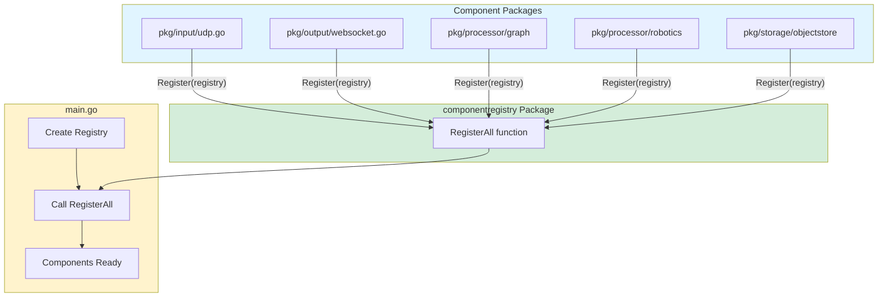
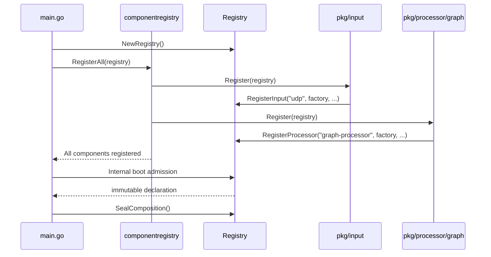

# Component Package

Core component infrastructure for SemStreams, providing explicit factory registration, immutable declaration discovery, ports, schemas, and lifecycle interfaces.

## Overview

The component package defines the fundamental abstractions for all SemStreams components, enabling dynamic discovery, registration, and management of input, processor, output, storage, and gateway components. This package follows explicit registration patterns with dependency injection through structured configuration.

Components in SemStreams are self-describing units whose declarations support boot composition and diagram
validation. Their configuration is validated through schemas, and ComponentManager owns their lifecycle. The package
supports five types of components: inputs (data sources), processors (data transformers), outputs (data sinks),
storage (persistence), and gateways (query surfaces).

The Registry stores factory metadata and immutable declarations admitted during boot. ComponentManager is the sole owner of live component handles and lifecycle control. After boot admission, Registry is sealed.

## Installation

```go
import "github.com/c360/semstreams/component"
```

## Architecture

### Component Registration Flow

SemStreams uses **EXPLICIT registration** rather than init() self-registration:


```mermaid
flowchart TB
    subgraph Packages["Component Packages"]
        UDP[pkg/input/udp.go]
        WS[pkg/output/websocket.go]
        Graph[pkg/processor/graph]
        Robotics[pkg/processor/robotics]
        ObjStore[pkg/storage/objectstore]
    end

    subgraph Orchestration["componentregistry Package"]
        RegisterAll[RegisterAll function]
    end

    subgraph Main["main.go"]
        CreateReg[Create Registry]
        CallRegAll[Call RegisterAll]
        Ready[Components Ready]
    end

    UDP -->|"Register(registry)"| RegisterAll
    WS -->|"Register(registry)"| RegisterAll
    Graph -->|"Register(registry)"| RegisterAll
    Robotics -->|"Register(registry)"| RegisterAll
    ObjStore -->|"Register(registry)"| RegisterAll

    CreateReg --> CallRegAll
    RegisterAll --> CallRegAll
    CallRegAll --> Ready

    style Packages fill:#e1f5ff
    style Orchestration fill:#d4edda
    style Main fill:#fff3cd
```

### Registration Pattern

Each component package exports a `Register()` function:


```mermaid
sequenceDiagram
    participant Main as main.go
    participant CR as componentregistry
    participant Reg as Registry
    participant UDP as pkg/input
    participant Graph as pkg/processor/graph

    Main->>Reg: NewRegistry()
    Main->>CR: RegisterAll(registry)
    CR->>UDP: Register(registry)
    UDP->>Reg: RegisterInput("udp", factory, ...)
    CR->>Graph: Register(registry)
    Graph->>Reg: RegisterProcessor("graph-processor", factory, ...)
    CR-->>Main: All components registered
    Main->>Reg: Internal boot admission
    Reg-->>Main: immutable declaration
    Main->>Reg: SealComposition()
```

### Why Explicit Registration?

| Aspect | init() Self-Registration | Explicit Registration |
|--------|-------------------------|----------------------|
| **Testability** | ❌ Global state, hard to isolate | ✅ Create isolated test registries |
| **Explicitness** | ❌ Hidden dependencies via imports | ✅ Clear dependency graph |
| **Control** | ❌ Automatic on import | ✅ Application controls what/when |
| **Side Effects** | ❌ Package import modifies globals | ✅ No side effects from imports |
| **Debugging** | ❌ Registration order unclear | ✅ Deterministic, explicit order |

### FlowGraph Component

The FlowGraph component (`flowgraph/`) provides **static analysis and validation** of component interconnections. It is used by the flow validator to analyze saved or draft diagrams before explicit publication.

**Purpose**: Build and validate connectivity graphs from component port definitions

**Key Responsibilities**:
- Build connectivity graphs from component port definitions
- Auto-discover connections via pattern matching (NATS subjects, KV buckets)
- Detect orphaned ports and disconnected components
- Validate interface contracts between connected ports
- Identify resource conflicts (e.g., network port binding)

**Important**: FlowGraph is a **validation tool**, not a runtime component. It creates temporary graph structures for diagram analysis and is discarded after validation completes.

**Relationship to Flow Infrastructure**:

```
Flow Service (HTTP API)
    ↓ uses
Flow Engine (Validation + Compilation)
    ↓ validation → FlowGraph (Static Analysis)
    ↓ explicit publication → Config Manager (next boot)
```

- **FlowGraph**: "Can these components connect?" (static graph analysis)
- **Flow Engine**: "Validate and compile this diagram" (authoring operation)
- **Flow Service**: "Save, validate, observe, or explicitly publish this diagram" (REST API layer)

Each layer has distinct, non-overlapping responsibilities.

## Quick Start

### Boot composition

Applications explicitly register factories before process composition:

```go
registry := component.NewRegistry()
if err := componentregistry.Register(registry); err != nil {
    return err
}
```

ComponentManager performs instance creation through the framework-internal
admission boundary, captures immutable declarations, retains every live handle,
and seals Registry. External callers do not create or recover runtime component
handles through Registry.

### Implementing a Component

```go
package mycomponent

import (
    "encoding/json"

    "github.com/c360/semstreams/component"
)

// Component implementation
type MyInput struct {
    config MyConfig
    deps   component.Dependencies
}

func (m *MyInput) Meta() component.Metadata {
    return component.Metadata{
        Name:        "my-input",
        Type:        "input",
        Description: "My custom input component",
        Version:     "1.0.0",
    }
}

func (m *MyInput) InputPorts() []component.Port { return nil }

func (m *MyInput) OutputPorts() []component.Port {
    return []component.Port{
        {
            Name:      "output",
            Direction: component.DirectionOutput,
            Required:  true,
            Config:    component.NATSPort{Subject: "my.output"},
        },
    }
}

func (m *MyInput) ConfigSchema() component.ConfigSchema {
    return component.ConfigSchema{
        Properties: map[string]component.PropertySchema{
            "interval": {Type: "duration", Description: "Poll interval"},
        },
    }
}

func (m *MyInput) Health() component.HealthStatus {
    return component.HealthStatus{Healthy: true}
}

func (m *MyInput) DataFlow() component.FlowMetrics {
    return component.FlowMetrics{}
}

// Factory function
func CreateMyInput(rawConfig json.RawMessage, deps component.Dependencies) (component.Discoverable, error) {
    var config MyConfig
    if err := json.Unmarshal(rawConfig, &config); err != nil {
        return nil, err
    }

    return &MyInput{
        config: config,
        deps:   deps,
    }, nil
}

// IMPORTANT: Export Register() function, NOT init()
func Register(registry *component.Registry) error {
    return registry.RegisterWithConfig(component.RegistrationConfig{
        Name:        "my-input",
        Factory:     CreateMyInput,
        Schema:      myInputSchema,
        Type:        "input",
        Protocol:    "custom",
        Domain:      "network",
        Description: "My custom input component",
        Version:     "1.0.0",
    })
}
```

Then add to `pkg/componentregistry/register.go`:

```go
import "github.com/yourorg/semstreams/pkg/mycomponent"

func registercore (registry *component.Registry) error {
    // ... existing registrations

    if err := mycomponent.Register(registry); err != nil {
        return err
    }

    return nil
}
```

## core Concepts

### Discoverable Interface

Every component must implement:

```go
type Discoverable interface {
    Meta() Metadata                  // Component metadata
    InputPorts() []Port              // Input port definitions
    OutputPorts() []Port             // Output port definitions
    ConfigSchema() ConfigSchema      // Configuration schema
    Health() HealthStatus            // Current health status
    DataFlow() FlowMetrics          // Data flow metrics
}
```

### Dependencies

Dependency injection structure:

```go
type Dependencies struct {
    NATSClient      *natsclient.Client      // Required: messaging
    ObjectStore     ObjectStore             // Optional: persistence
    MetricsRegistry *metric.MetricsRegistry // Optional: Prometheus
    Logger          *slog.Logger            // Optional: logging
    Platform        PlatformMeta            // Required: identity
}
```

### Port Types

Components declare ports using strongly-typed configurations:

```go
// NATS Pub/Sub
component.NATSPort{Subject: "data.output"}

// JetStream durable streaming
component.JetStreamPort{Stream: "EVENTS", Subject: "events.>"}

// KV bucket watch
component.KVWatchPort{Bucket: "CONFIG", Keys: []string{"app.*"}}

// KV bucket write
component.KVWritePort{
    Bucket: "ENTITY_STATES",
    Interface: &component.InterfaceContract{
        Type:    "graph.EntityState",
        Version: "v1",
    },
}

// Network binding
component.NetworkPort{Protocol: "udp", Port: 14550, Bind: "0.0.0.0"}
```

## API Reference

### Registry

#### `NewRegistry() *Registry`

Creates an empty registry for explicit factory registration and boot admission.

#### `RegisterWithConfig(config RegistrationConfig) error`

Registers a component factory and its static metadata before composition seals.

#### `ListAvailable() map[string]Info`

Returns defensive component-type metadata. Registry declaration reads likewise
return defensive values and never expose a live component handle.

Component creation, declaration admission, and sealing require the
framework-internal admission token and are not adopter APIs.

### Types

#### `Factory`

```go
type Factory func(rawConfig json.RawMessage, deps Dependencies) (Discoverable, error)
```

Factory function signature for component creation.

## Error Handling

### Error Types

```go
ErrFactoryAlreadyExists // Duplicate factory registration
ErrInvalidFactory       // Invalid factory registration
ErrFactoryNotFound      // Unknown factory name during internal boot admission
ErrComponentCreation    // Factory execution failed during internal boot admission
```

### Error Detection

```go
err := registry.RegisterWithConfig(registration)
if errors.Is(err, component.ErrFactoryAlreadyExists) {
    // Registration was repeated before composition sealed.
}
```

## Testing

### Isolated Test Registries

```go
func TestMyComponent(t *testing.T) {
    // Create isolated registry for this test
    registry := component.NewRegistry()

    // Register only components needed
    if err := mycomponent.Register(registry); err != nil {
        t.Fatal(err)
    }

    factories := registry.ListAvailable()
    assert.Contains(t, factories, "my-input")
}
```

### Testing Patterns

- ✅ Use real NATS via `natsclient.NewTestClient()` for integration tests
- ✅ Create isolated registries per test to avoid global state
- ✅ Mock external dependencies that cannot be containerized
- ✅ Test component behavior through Discoverable interface
- ✅ Verify public factory metadata and schemas through defensive values

## Performance

### Registry Operations

| Operation | Complexity | Thread-Safe |
|-----------|-----------|-------------|
| Factory lookup | O(1) | Yes (read lock) |
| Component creation | O(1) + factory time | Yes (read lock) |
| Factory registration | O(1) | Yes (write lock) |
| List operations | O(n) | Yes (read lock) |

### Concurrency

- Multiple goroutines can create components concurrently
- Factory registration blocks component creation temporarily
- No deadlocks due to ordered lock acquisition
- Components maintain references until explicitly unregistered

## Architecture Decisions

### Explicit Registration vs init()

**Decision**: Use explicit Register() functions

**Rationale**:

- **Testability**: Can create isolated registries without global state
- **Explicitness**: Clear component dependency graph in componentregistry
- **Control**: Application controls what gets registered and when
- **No side effects**: Package imports don't modify global state
- **Deterministic**: Registration order is explicit and controllable

**Tradeoffs**:

- Requires componentregistry orchestration package
- Registration must be explicitly called in main()
- New components must update componentregistry.RegisterAll()

### Dependency Injection via Struct

**Decision**: Use Dependencies struct

**Rationale**:

- Avoids parameter proliferation
- Easy to add dependencies without breaking factories
- Enables testing with mock dependencies
- Follows service architecture patterns

### Factory Pattern

**Decision**: Components parse their own configuration

**Rationale**:

- Enables flexible validation per component
- Matches service constructor patterns
- Centralizes configuration knowledge in component packages

## Related Packages

- [pkg/componentregistry](../componentregistry): Orchestrates component registration
- [pkg/service](../service): Manager uses Registry for lifecycle
- [pkg/types](../types): ComponentConfig and ComponentType definitions
- [pkg/natsclient](../natsclient): NATS client dependency
- [pkg/metric](../metric): Optional Prometheus metrics
