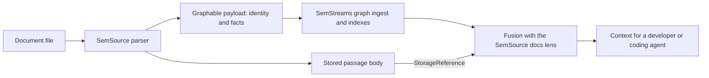

# Building context with SemSource

SemSource shows how a Go application can use SemStreams to give developers and coding agents useful, inspectable
context. It discovers source material, models its meaning, and serves relevant bodies and relationships. An agent
can use that context while helping a human build software; the application providing it does not need an agent loop.

This walkthrough follows one document passage from a file into a context response. It explains the implementation
at [SemSource commit 4093d3c][ss-version], which depends on [SemStreams v1.0.0-beta.160][ss-dependency]. It is a
source-backed account of composition, not a reconstruction of development conversations or a current-main upgrade
guide. Where framework contracts have changed since that dependency, the differences are called out explicitly.

## Why this is a framework example

A coding agent needs more than a text match. It needs to know what a result represents, where its content came from,
which relationships matter, and what the response leaves unresolved. If those meanings exist only in a developer's
memory or scattered glue code, both the agent and its human collaborator must rediscover them.

SemStreams provides places to declare those meanings: entity identities, typed facts and relationships, registered
payloads, component ports, content references, and retrieval contracts. SemSource supplies the source-specific
interpretation. The resulting application can expose context in terms its users recognize: a document, a passage,
a code symbol, or a source location.

The [framework/product boundary][product-boundary] is the organizing principle:

| Concern | SemSource owns | SemStreams provides |
| --- | --- | --- |
| Source meaning | Discovery, parsing, passage boundaries, source vocabulary | Graphable and typed triples |
| Application composition | Selected components, source configuration, domain payloads | Registries, ports and lifecycle machinery |
| Content | Which bytes belong to a passage and their storage reference | Storage interfaces, ObjectStore and body resolution |
| Retrieval | Code/docs lenses, domain routes and presentation | Graph operations and deterministic fusion |
| Human participation | Product experience and application policy | Optional agent controls and observable action evidence |

A framework primitive is useful here when it replaces repeated application logic with an explicit contract. That
principle also applies to telemetry and other applications that never use models.

## Follow a document passage

### 1. Model what the source means

SemSource's [document handler][ss-doc-handler] reads a file, splits its content into passages, and creates a parent
document plus passage entities. A passage's [triples][ss-doc-facts] describe its path, title, ordinal, section, and
relationship to its parent. These are product decisions: the framework does not decide what counts as a useful
passage or which source relationships matter.

The handler produces entity state. SemSource's [publication adapter][ss-payload-adapter] then packages it as a
[Graphable payload][ss-payload], with `EntityID()` and `Triples()` methods and a storage reference. This distinction
matters when following the code: the passage model and the payload crossing the ingest boundary are separate types.
See the framework's [Graphable guide][graphable] and [vocabulary guide][vocabulary] for the underlying contracts.

For a new application, follow the current [entity identity contract][identity], whose order is
`org.platform.system.domain.type.instance`. The inspected SemSource release uses an older
[identity helper][ss-identity]. Its segment order and product-name authority are historical implementation details;
they are not templates for a new adopter.

### 2. Store content and carry a reference

A passage has both semantic facts and verbatim content. SemSource [stores the passage bytes][ss-doc-body] under a
content-derived key and retains a `StorageReference`. Its triples also carry the body-store and body-key handles
that the docs lens will read later. The parent document is a navigational entity and does not carry a passage body.

The reference's `StorageInstance` identifies a registered storage component instance, not a bucket name. The
framework [body resolver][body-resolver] maps that instance to a store and fetches the referenced object. A source
path can remain a useful citation without becoming an instruction to open a file on the retrieval server.

This makes a remote context gateway possible: it needs access to the configured graph and body store, not the
parser's checkout. The product still has to compose that access. A stored reference does not itself guarantee
connectivity, authorization, or that the object remains available.

### 3. Compose and publish explicitly

SemSource's process entry point [registers framework and product factories][ss-factories] and
[builds its payload registry][ss-payload-registry]. The selected components and dependencies are assembled in one
composition root. Payload registration is explicit; adding a Go type alone does not register its wire decoder.
Use the current [payload registry guide][payload-registry] when building your own binary.

The product [publisher][ss-publisher] wraps the domain payload in a `BaseMessage` and publishes to its configured
graph ingest path. The pinned [graph composition][ss-graph-composition] connects this to graph ingestion and
`ENTITY_STATES`. The framework maintains graph state and the selected indexes; SemSource owns parsing and source
publication.

The useful distinction is between a fact and work to perform. Current state can be read and watched through KV;
durable work requests use JetStream streams. `ENTITY_STATES` is current authority, not a complete history of source
changes. See [KV state and watches][kv] and [streams versus watches][streams].

The pinned product code also contains explicit port lists and startup coordination. Read those as evidence of what
that release needed. They are not a recommendation that each new adopter should memorize framework subjects,
buckets, or startup timing. Current [composition validation][composition] and the related work linked below are
where that framework responsibility is defined and improved.

### 4. Retrieve through a domain lens

SemSource [constructs the framework fusion engine][ss-fusion] with a retrieval client, body resolver, and domain
lens. The [docs lens][ss-doc-lens] interprets document facts and reconstructs body references. A separate code lens
supplies code-specific meaning to the same framework mechanism.

The framework [fusion package][fusion] handles resolving candidates, expanding requested relationships, deduplicating,
ranking, and applying budgets. The lens supplies domain interpretation and display locations. This is the main reuse
point: the product describes its domain without implementing another generic context assembly engine.

The resulting [product API][ss-context-api] accepts a query and returns ranked nodes with requested content and
structure. The query's interpretation depends on the product lens and selected retrieval capability. SemSource
exposes code and document HTTP operations
and a [product MCP integration][ss-mcp]. Those are SemSource surfaces. Framework MCP graph access remains unavailable;
use the current [query access guide][query-access] to distinguish admitted framework operations and typed adapters.

## Read the response as evidence

An index being caught up does not establish that every relevant source has published. A file path does not establish
that the latest disk contents were indexed. A selected set of ranked results does not establish complete coverage.
These distinctions let an application explain uncertainty to both its users and its agents.

The current [fusion contract][fusion-spec] makes the following distinctions. They describe current SemStreams;
check the deployed product version before assuming it emits all these fields.

| Observation | What it establishes |
| --- | --- |
| Index status and revisions | Observed index progress; not complete source coverage or remote-source freshness |
| Miss | Resolution returned no candidate; not proof that an entity does not exist |
| Unhydrated seed | A candidate was resolved but its entity could not be returned |
| Body failure on a returned node | The entity was returned, but requested referenced content could not be loaded |
| Entity without a body reference | The domain entity may legitimately have no verbatim body |
| Truncation metadata | The applicable result or facet budget omitted content; inspect each requested facet |
| Start/end view revisions | Observed revisions, not proof of a coherent snapshot |

The pinned SemSource README says a not-ready graph returns an empty envelope and describes misses more strongly.
That older wording is **not** the current framework guarantee: a fusion miss never licenses an authoritative absence
claim. Consumers checking their own write's visibility use the revision contract; they do not infer absence from a
miss. Body retrieval failure likewise does not mean the source entity is absent.

This walkthrough reports source inspection, not a successful execution of the product or an acceptance test of its
compatibility with current SemStreams. The exercise below describes evidence to collect when running the product.

## Choose capabilities by need

Structural, statistical, and semantic capabilities are useful destinations in their own right. They are not steps
that every application must complete. The framework's [inference tiers][tiers] describe how text is indexed;
generation and agent loops are separate choices.

SemSource's inspected [profile documentation][ss-tiers] numbers its profiles differently:

| Capability | Framework tier | Pinned SemSource label | Additional model dependency |
| --- | --- | --- | --- |
| Explicit structure and relationships | 0 — Structural | Structural | None |
| Lexical search with BM25 | 1 — Statistical | 0 — Statistical | None; BM25 runs in Go |
| Neural embedding search | 2 — Semantic | 1 — Semantic | Embedding service; may run locally |
| Optional generative enrichment | Separate choice | 2 — Semantic + Instruct | Instruct model service |

The inspected profile files are `configs/tiers/tier0-statistical.json` for BM25 and
`configs/tiers/tier1-semantic.json` for neural retrieval. The semantic profile is the pinned product's MVP default.
Its code/docs context path does not require generative
completion or an agent loop. The instruct profile's top-level checkmark is misleading without its qualification:
[`tier2-semantic-instruct.json` is a wiring example][ss-instruct], with clustering disabled. A separate
[development overlay][ss-instruct-dev] enables it; the product documentation does not establish live end-to-end
community/LLM proof for that path.

For local or edge use, account for the actual dependencies: NATS JetStream, persisted content and graph data, source
paths, and any selected model service. Structural and BM25 retrieval need no model server. A neural service can be
local; "external service" means outside the Go process, not necessarily outside the site.

Local operation and synchronization between disconnected sites are different requirements. A deployment that reads
remote sources or calls a remote model still depends on those connections. Measure the chosen workload and test its
disconnected behavior; this example supplies no RAM budget, Raspberry Pi benchmark, or automatic intersite sync proof.

## Add agent loops or human decisions when the application needs them

The coding agent using SemSource can remain outside the application. If a product later needs its own agents,
SemStreams provides [optional agent components][agentic] and [approval controls][approval]. The application chooses
which actions need human participation and how those decisions appear in its user experience.

Tool effect metadata describes an action; it does not itself select approval policy. Action identities and trajectory
observations help explain execution, with [explicit limits on evidence completeness][trajectory]. These mechanisms
support application policy without imposing the same autonomy or human-review rules on every product.

## Try the path as an adopter

Use the pinned [SemSource usage documentation][ss-context-api] and [profile setup instructions][ss-tiers] for the
actual product commands. Choose the statistical or semantic profile and point it at a small, known source corpus.
The shipped tier files use container paths; native runs need real host paths. This is a product exercise, not a
command to run in this framework checkout.

**Query limitation in the inspected release:** the [docs lens][ss-doc-query] sends path-shaped input to prefix
resolution, while the [beta.160 framework adapter][beta160-prefix] expects an entity-ID prefix and does not translate
a source file path. The product README's raw-path claim is not established by this implementation. Use prose from
the passage for this exercise; keep the path as a citation to compare in the result. This prose route needs BM25 or
neural retrieval, so this particular exercise does not prove the structural-only profile.

1. Pick one short Markdown document in that corpus. Record a passage's text, heading and path so you have a known
   source to compare with retrieval.
2. Observe source ingestion and the relevant index status using the product's documented surfaces. Record the
   product commit, framework dependency, configuration and observations.
3. Submit a distinctive prose phrase from the passage to the documented `POST /doc-context/context` operation with
   `want: ["body"]`. The product API documents optional `max_nodes` and `max_bytes` budgets. Inspect the returned
   passage, location,
   provenance and any readiness or partial-result disclosures against the indexed source.
4. Repeat with a smaller budget and inspect the truncation behavior. Then query a nonexistent term and record the
   response without treating it as proof of absence. Compare the deployed version's behavior with its own contract.
5. If lexical or semantic search matters to your application, repeat with a query that shares source words and a
   paraphrase. Record relevance and dependencies for the selected profiles; do not infer quality from a tier number.

A useful result is a small set of captured requests, responses and source comparisons that a developer can inspect
with their coding agent. It demonstrates which context is available and which assumptions still require attention.
It does not need generated prose or an autonomous runtime to demonstrate framework value.

## Where this example informs v1 work

This account gives [SemSource adoption work (#753)][adoption-issue] a concrete path to exercise. The shared
[readiness front door (#795)][readiness-issue] and composition work on
[validation/boot parity (#1107)][validation-issue] and [default declarations (#1108)][defaults-issue] address places
where builders still have to understand framework details. Their issues own implementation and status; this
walkthrough does not close them or establish current-main product compatibility.

Broader [orchestration documentation cleanup (#457)][orchestration-issue] remains separate. Keep this example focused
on the context path: source meaning, framework composition, content retrieval, and what the returned evidence supports.

[ss-version]: https://github.com/C360Studio/semsource/tree/4093d3ce421371f4a99d7168e372552899bf6795
[product-boundary]: ../../openspec/project.md#product-boundary
[graphable]: 03-graphable-interface.md
[vocabulary]: 04-vocabulary.md
[identity]: ../adr/102-entity-id-segment-semantics.md
[body-resolver]: ../../pkg/fusion/hydrate.go
[payload-registry]: ../concepts/15-payload-registry.md
[kv]: ../concepts/02-kv-twofer.md
[streams]: ../concepts/03-streams-vs-kv-watches.md
[composition]: ../../openspec/specs/composition-validation/spec.md
[fusion]: ../../pkg/fusion/doc.go
[fusion-spec]: ../../openspec/specs/fusion/spec.md
[query-access]: ../concepts/11-query-access.md
[tiers]: ../concepts/00-real-time-inference.md
[agentic]: ../concepts/13-agentic-systems.md
[approval]: 07-agentic-quickstart.md#understanding-the-configuration
[trajectory]: ../../openspec/specs/agentic-loop/spec.md
[ss-dependency]: https://github.com/C360Studio/semsource/blob/4093d3ce421371f4a99d7168e372552899bf6795/go.mod#L8
[ss-doc-handler]: https://github.com/C360Studio/semsource/blob/4093d3ce421371f4a99d7168e372552899bf6795/handler/doc/entities.go#L289
[ss-doc-facts]: https://github.com/C360Studio/semsource/blob/4093d3ce421371f4a99d7168e372552899bf6795/handler/doc/entities.go#L174
[ss-payload-adapter]: https://github.com/C360Studio/semsource/blob/4093d3ce421371f4a99d7168e372552899bf6795/internal/entitypub/entity_state.go#L18
[ss-payload]: https://github.com/C360Studio/semsource/blob/4093d3ce421371f4a99d7168e372552899bf6795/graph/event_payload.go#L45
[ss-identity]: https://github.com/C360Studio/semsource/blob/4093d3ce421371f4a99d7168e372552899bf6795/entityid/entityid.go#L25
[ss-doc-body]: https://github.com/C360Studio/semsource/blob/4093d3ce421371f4a99d7168e372552899bf6795/handler/doc/entities.go#L349
[ss-factories]: https://github.com/C360Studio/semsource/blob/4093d3ce421371f4a99d7168e372552899bf6795/cmd/semsource/run.go#L264
[ss-payload-registry]: https://github.com/C360Studio/semsource/blob/4093d3ce421371f4a99d7168e372552899bf6795/cmd/semsource/run.go#L278
[ss-publisher]: https://github.com/C360Studio/semsource/blob/4093d3ce421371f4a99d7168e372552899bf6795/internal/entitypub/publisher.go#L335
[ss-graph-composition]: https://github.com/C360Studio/semsource/blob/4093d3ce421371f4a99d7168e372552899bf6795/cmd/semsource/run.go#L731
[ss-fusion]: https://github.com/C360Studio/semsource/blob/4093d3ce421371f4a99d7168e372552899bf6795/processor/code-context/component.go#L209
[ss-doc-lens]: https://github.com/C360Studio/semsource/blob/4093d3ce421371f4a99d7168e372552899bf6795/source/fusion/lens/docs/docs.go#L102
[ss-context-api]: https://github.com/C360Studio/semsource/blob/4093d3ce421371f4a99d7168e372552899bf6795/README.md#L464
[ss-mcp]: https://github.com/C360Studio/semsource/blob/4093d3ce421371f4a99d7168e372552899bf6795/docs/integration/mcp-quickstart.md#L1
[ss-tiers]: https://github.com/C360Studio/semsource/blob/4093d3ce421371f4a99d7168e372552899bf6795/configs/tiers/README.md#L1
[ss-instruct]: https://github.com/C360Studio/semsource/blob/4093d3ce421371f4a99d7168e372552899bf6795/configs/tiers/README.md#L141
[ss-instruct-dev]: https://github.com/C360Studio/semsource/blob/4093d3ce421371f4a99d7168e372552899bf6795/configs/tiers/README.md#L173
[adoption-issue]: https://github.com/C360Studio/semstreams/issues/753
[readiness-issue]: https://github.com/C360Studio/semstreams/issues/795
[validation-issue]: https://github.com/C360Studio/semstreams/issues/1107
[defaults-issue]: https://github.com/C360Studio/semstreams/issues/1108
[orchestration-issue]: https://github.com/C360Studio/semstreams/issues/457
[ss-doc-query]: https://github.com/C360Studio/semsource/blob/4093d3ce421371f4a99d7168e372552899bf6795/source/fusion/lens/docs/docs.go#L50
[beta160-prefix]: https://github.com/C360Studio/semstreams/blob/8403a2218000e45a31c5132fbfe01af42ed04f14/pkg/fusion/fusionnats/client.go#L249
