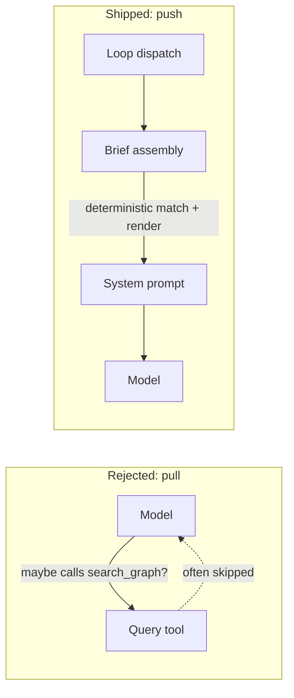
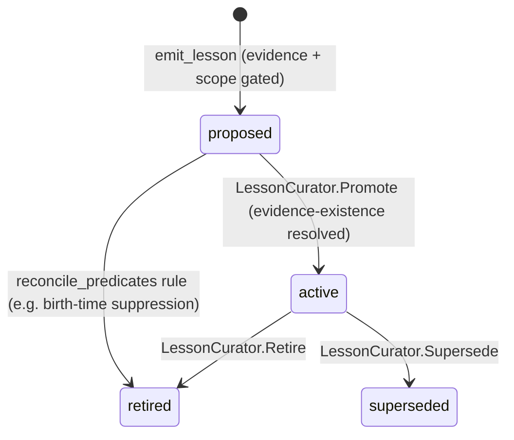

# Agent Memory

SemStreams gives agents memory across three layers — episodic, semantic, procedural — entirely as
views over the existing graph + KV substrate. There is no dedicated memory store, and (this is the
load-bearing decision) there is no agent-invoked memory *query* tool. Memory reaches agents by
push. See [ADR-080](../adr/080-push-based-agent-memory-and-lesson-artifacts.md) for the accepted
decision record this page describes.

## Push, Not Pull

The framework already tried the obvious design once: expose memory as agent-callable tools
(`search_graph`, `query_*`) and let the model decide when to look something up. It failed on
interface friction, not on the model — agents fell back to training-corpus habits (grep and
friends) instead of calling the tools, so the tools were removed. That failure is why memory in
SemStreams is delivered, not fetched.



Concretely: at loop dispatch, brief assembly deterministically matches active lessons against the
loop's scope and renders them straight into the system prompt — no tool call, no model judgment
about whether to look. The one surviving pull is following a reference a brief already handed
over — `read_loop_result(loop_id, max_bytes, offset)` to fetch a prior loop's full output, or
`query_entity` on a lesson ID a brief cited — never an open-ended search. Generic graph-read tools
(`query_entity`, `graph_query`, `search_graph`) still exist and remain useful, but they are
governed per-role by tool allowlists: by convention, worker roles should not carry them, while
observation roles like the [ops agent](../adr/027-ops-agent-meta-harness.md) legitimately do.

## The Three Memory Layers

The three-layer taxonomy (episodic / semantic / procedural) is the industry-converged model
(CoALA and 2025–26 practice). SemStreams maps each layer onto substrate that already exists:

| Layer | Answers | Framework surface | Access |
|---|---|---|---|
| **Episodic** — what happened | `AGENT_LOOPS` KV (`COMPLETE_{loopID}`, full text) + `agent.complete.*` JetStream stream + `AGENT_TRAJECTORIES` KV | `read_loop_result` dereferences a handed loop ID within the retention window |
| **Semantic** — what's true | The knowledge graph, with BM25 (Tier 1) and neural (Tier 2) embeddings for text content | Per-role-allowlisted graph-read tools (`query_entity`, `graph_query`, `search_graph`); worker roles conventionally excluded |
| **Procedural** — what to do | `agent.lesson.*` predicates + `emit_lesson` writer + `LessonCurator` promotion lane + `lessonmatch` matcher | Pushed into the system prompt at brief assembly — never a tool call |

Episodic content is not durable: `AGENT_LOOPS` defaults to a 24-hour KV TTL and the
`agent.complete.*` stream retains 7 days. That cliff is precisely why lesson distillation is
event-driven rather than batched — it runs while the full loop content it cites as evidence still
exists (ADR-080 decision 4). Once the cliff passes, only what was already distilled into a durable
`agent.lesson.*` entity survives; the raw trajectory does not.

## The Symptom → Layer → Provider Matrix

Diagnosing *why* an agent is misbehaving starts with naming which layer is actually deficient,
then which producer owns fixing it. A common trap is reaching for a lesson when the real gap is
a missing or wrong graph fact.

| Symptom | Layer | Provider | Fix shape |
|---|---|---|---|
| "What did loop X do three hours ago?" | Episodic | `AGENT_LOOPS` / `agent.complete.*` / trajectory | `read_loop_result` while the retention window still holds it |
| "Is fact F about the world still true?" | Semantic | The graph, via its owning content producer | Correct the graph directly — it is the single source of truth, always queryable and correctable |
| "The agent keeps repeating pitfall P across loops" | Procedural | `agent.lesson.*` via `emit_lesson` | Distil an evidence-cited lesson; a product curator promotes it once its evidence resolves |
| "The agent asserts an unresolvable API coordinate" (example: an unresolved OGC/MAVLink field mapping) | Semantic, **not** procedural | A graph content producer (e.g. [semsource](16-federation.md) pointed at the source repository) | The correct coordinate belongs in the graph, not in a lesson — a lesson emitted here may only carry the **policy** ("verify this class of coordinate against the source lens before asserting"), never the coordinate value itself |

The last row is the one teams get wrong most often. An agent hallucinating or Goodharting an
unresolvable fact is a **content gap**, not a lessons gap — the fix is pointing a semantic-content
producer at the authoritative source, not teaching the agent a memorized value that will drift the
moment the source changes. (Whether semsource's AST lens currently resolves the language/build
tooling for a given source repository — e.g. Java/Gradle — is unverified here; that is a
semsource-side question, not a SemStreams framework decision.)

## The Lesson Lifecycle

A lesson is a first-class graph entity — `{org}.{platform}.agent.lesson.record.{uuid5}` — with a
gated lifecycle. Only `active` lessons are ever injected.



**Birth.** `emit_lesson` (`processor/agentic-tools/emit_lesson.go`) is the ops agent's
lesson-distillation tool, a sibling of `emit_diagnosis` on the [ADR-027](../adr/027-ops-agent-meta-harness.md)
observation seam. Every call is writer-gated:

- at least one well-formed 6-part evidence entity ID (existence is *not* checked yet — that is a
  promotion-time gate, not an emit-time one);
- `injection_form` rejected (never truncated) over a 320-byte bound, with the bound named in the
  error so the agent can rewrite;
- at least one typed `applies_to` scope key — `id:<entity-ID prefix of 3+ segments>` or
  `tag:<token>` — matched on entity-ID segment boundaries, never a raw string prefix;
- a per-loop emission cap (default 20), since one ops loop legitimately emits several lessons
  (`StopLoop: false`).

Identity is **content-derived**: a UUIDv5 over category, sorted `applies_to`, summary, and sorted
evidence. Re-emitting an identical lesson always derives the same entity ID, so distillation is
naturally idempotent — no separate dedup pass required.

**Promotion.** `LessonCurator.Promote` (`processor/agentic-tools/lesson_promotion.go`) is the
validated path: it resolves that *every* cited evidence entity actually exists in the graph and
refuses the promotion — leaving the lesson `proposed` — if any citation is missing. Promotion,
retirement, and supersession all ride the canonical single-valued **reconcile** operation, never an
append, so a lifecycle transition can never accumulate stale status values. Retired and
superseded lessons stay durable in the graph for audit — they leave future briefs, never the
graph.

**Delivery.** The deterministic matcher (`processor/agentic-loop/lessonmatch`) selects only
`active` lessons whose scope matches the dispatching loop, orders them severity → immutable
`created-at` → entity ID (replay-stable across an ADR-073 from-zero reingest, because the ordering
key is never a KV revision or a re-stamped update time), and bounds the result by a count ceiling
(K ≤ 25, default 10) and a total-byte budget (default 4096 bytes). The rendered block states
matched-versus-included counts, so truncation is visible in the prompt itself rather than silent.

## Lessons Carry Policy, Not Facts

Facts belong in the graph: queryable, correctable, and the single source of truth for "what is
true right now." A lesson never freezes a fact — it carries durable **guidance** about how to
behave, and it cites the evidence it was derived from (`agent.lesson.evidence`, annotated with the
PROV-O `prov:wasDerivedFrom` IRI in `vocabulary/standards.go`). If the underlying fact changes, the
graph is corrected directly; the lesson's policy either still holds or gets retired — it is never
the place a corrected fact gets re-asserted.

This is why the coordinate-resolution example above is not a lessons problem: a lesson that
"remembered" the correct coordinate would be a second, uncorrectable copy of a fact that belongs
in the graph. The lesson's proper job in that scenario is narrower and more durable — *verify
before asserting* — which stays true even after the underlying coordinate is fixed.

## Example Category Taxonomies (Documentation Only)

`agent.lesson.category` is deliberately an **open** predicate — the framework ships no
closed category enum (Product Boundary: categories are product vocabulary, not framework schema).
The examples below are illustrative starting points for a product's own taxonomy, not framework
enums, and nothing in SemStreams enforces or special-cases them:

- `retention-policy` — guidance about KV/stream lifetime interactions (e.g. "distil before the
  24h/7d episodic cliff, not after").
- `api-contract` — guidance about an external API's quirks or non-obvious constraints.
- `coordinate-resolution` — guidance about verifying a specific class of fact against its
  authoritative source before asserting it (see the decision matrix above).

A product is free to invent its own set, mix taxonomies, or use none at all — `emit_lesson`
accepts any non-empty string.

## Worked Example

This walks the full lesson lifecycle — configure → emit → query → promote →
observe injection — against a running instance, using the minimal template flow
[`configs/flows/lesson-example.json`](../../configs/flows/lesson-example.json)
and its
[persona fragment](../../configs/personas/fragments/lesson-example/00-identity.md).
Every subject, predicate, endpoint, and API below is grep-verified against the
shipped code. The template's role is `lesson-example` (org `c360`, platform
`lesson-example`); substitute your own identity when you copy it.

The automated end-to-end proof of this exact round-trip is the ops e2e scenario
([`test/e2e/scenarios/ops/scenario.go`](../../test/e2e/scenarios/ops/scenario.go),
stages `verify-lesson-proposed → promote-lesson → inject-and-verify-lesson`); run
it with `task e2e:agentic` when you want the whole path exercised in CI.

### 1. Configure the emitting + receiving agent

The template is the smallest agentic flow that both emits and receives lessons.
Two pieces do the work:

- **Allowlist** — the `agentic-tools` component grants exactly one tool,
  `emit_lesson`:

  ```json
  "allowed_tools": [
    "emit_lesson"
  ]
  ```

  `emit_lesson` returns `StopLoop: false`, so after emitting its lesson(s) the
  loop ends by **natural terminal-tool-less completion** — the model returns a
  text-only response with no further tool call. There is no `submit_work`
  terminator (it is not a registered executor). A real emitter that gathers its
  own evidence would also grant `read_loop_result` and `query_entity`; the
  template omits them to stay minimal.

- **Persona snippet** — the emit contract lives in the persona fragment (loaded at
  boot by `persona.LoadFromDirectory`; the role-dir name `lesson-example` must
  equal `agentic-dispatch.default_role`). Its load-bearing gates:

  > - Evidence: cite at least one real, well-formed 6-part entity ID in
  >   `evidence_entity_ids`.
  > - Injection form: keep `injection_form` at or under 320 bytes.
  > - Scope: supply at least one typed `applies_to` key. Use
  >   `"tag:lesson-example"` so the lesson reaches future loops of this role.
  > - `polarity` is `"avoid"` or `"best_practice"`; `severity`
  >   (`info | warning | critical`) only orders lessons. Do NOT pass identity
  >   fields — the framework derives loop/role attribution.

The **receive** side needs no configuration: brief assembly derives this loop's
scope from its role as `tag:lesson-example`
(`processor/agentic-loop/lessons.go` `deriveLoopScope`) and injects any matching
active lesson automatically.

Validate the config with the real loader before running:

```bash
go run ./cmd/semstreams --config configs/flows/lesson-example.json --validate
# ✓ Configuration is valid
```

### 2. Emit a lesson

An agent produces a single `emit_lesson` tool call whose `Arguments` carry only
intent (no identity fields). For the template's identity:

```json
{
  "summary": "Bound retries on network timeouts to protect the iteration budget",
  "detail": "Unbounded network-timeout retries burned the iteration budget before work ran; cap backoff, fail fast.",
  "injection_form": "Avoid unbounded retries on network timeouts; cap at 3 attempts.",
  "category": "retry-policy",
  "polarity": "avoid",
  "severity": "warning",
  "evidence_entity_ids": ["c360.lesson-example.agent.agentic-loop.execution.loop-0001"],
  "applies_to": ["tag:lesson-example"]
}
```

Each argument maps to one `agent.lesson.*` predicate on the born entity;
`evidence_entity_ids` cites the loop/trajectory/entity the lesson was derived
from (a loop execution entity is
`{org}.{platform}.agent.agentic-loop.execution.{loopID}`). The gates
(`evidence`, `bound`, `grammar`, `cap`) reject a malformed call with an
instructive error rather than truncating it.

The lesson is born `status="proposed"` with a **content-derived** entity ID
(`{org}.{platform}.agent.lesson.record.{uuid5}` over category + sorted
`applies_to` + summary + sorted evidence), so re-emitting the identical lesson is
idempotent. The tool result reports the minted ID and persisted status:

```json
{
  "lesson_id": "c360.lesson-example.agent.lesson.record.<uuid5>",
  "lesson_status": "proposed",
  "lesson_created": true
}
```

**Reproducing the emit without an LLM.** In production the `agentic-loop`
dispatch stamps `loop_id` and the `agent.role` metadata onto the tool call and
publishes it — as a `BaseMessage` envelope — to `tool.execute.emit_lesson`; the
result returns on `tool.result.*`. The runnable no-LLM driver of exactly that
wire is the integration test, which mirrors what a shell publish would have to
construct:

```bash
go test -tags=integration -run TestIntegration_EmitLesson_ProductionWire \
  ./processor/agentic-tools/
```

(see [`emit_lesson_integration_test.go`](../../processor/agentic-tools/emit_lesson_integration_test.go)).
It publishes the enveloped `ToolCall` to `tool.execute.emit_lesson`, asserts the
`proposed` entity landed in `ENTITY_STATES`, and proves the idempotent re-emit
path — the same shape you would reproduce by hand.

### 3. Query the proposed lesson

The `service-manager` mux exposes `GET /graph/triples` in every flow (port from
`service-manager.http_port`, `8080` in the template). Query by predicate:

```bash
curl 'http://localhost:8080/graph/triples?predicate=agent.lesson.status'
```

It returns a JSON array of triples; the freshly emitted lesson reads `proposed`:

```json
[
  {
    "subject": "c360.lesson-example.agent.lesson.record.<uuid5>",
    "predicate": "agent.lesson.status",
    "object": "proposed",
    "source": "ops-emit-lesson",
    "confidence": 1
  }
]
```

The endpoint also filters on `subject=` and `object=` (empty = wildcard), so
`?predicate=agent.lesson.status&object=proposed` lists every proposed lesson.
This is exactly how the ops scenario's `verifyLessonProposed` stage confirms the
born state.

### 4. Promote the lesson

Promotion `proposed → active` is **operator/product-invoked**, not an agent tool
(ADR-080 makes review the default gate; there is no `promote_lesson` tool). The
validated path is `LessonCurator.Promote`, which resolves that **every** cited
evidence entity exists in the graph before flipping the status via the
single-valued reconcile operation (`graph.mutation.entity.reconcile`):

```go
// mutations is the application-configured *projection.MutationClient.
var lessonReconciler projection.PredicateReconciler = mutations
var lessonReader projection.AuthoritativeReader = mutations

curator := agentictools.NewLessonCurator(lessonReconciler, lessonReader, logger)
if err := curator.Promote(ctx, lessonEntityID); err != nil {
    // refused: a cited evidence entity is absent — the lesson stays proposed
}
```

The composition root constructs the client from copied local projection contracts.
The curator receives only the narrow reconcile and exact-read capabilities it needs.

If any citation is missing, `Promote` **refuses** and the lesson stays
`proposed`. `Retire` writes `retired` plus `retired-at`, while `Supersede` writes
`superseded` plus `superseded-by`; both live on the same curator and need no
evidence check. Re-run the step-3 query and the status now reads `active`.

> **Honest gap — config-only promotion is not viable for the validated path.**
> A rule `reconcile_predicates` action *can* mechanically flip `agent.lesson.status` to
> `active` (status is in the lesson lifecycle reconcile group — see
> [`configs/rules/lessons/README.md`](../../configs/rules/lessons/README.md)),
> but a rule condition can only match the lesson's **own** fields; it cannot
> resolve whether a *cited evidence entity* exists. So a bare-rule promotion is
> **ungated** — it would promote lessons whose evidence may be absent, defeating
> exactly the check ADR-080 requires. That is why the shipped reference rule is a
> birth-time **retire** (`category="deprecated" → status="retired"`), which needs
> no evidence check, and **not** a promote. The evidence-existence gate lives only
> in Go (`LessonCurator.Promote`). A pure-config product therefore has no way to
> reproduce validated promotion today; a first-class config/operator promotion
> surface that carries the evidence gate is a candidate UX follow-up.

### 5. Observe injection

Dispatch a *subsequent* loop of the same role — publish a `user.message` that the
`lesson-example` dispatch routes to a new loop. Brief assembly derives that loop's
scope as `tag:lesson-example`, the matcher selects the now-`active` lesson (only
`active` lessons are ever injected), and `renderLessonBlock`
(`processor/agentic-loop/lessons.go`) renders it verbatim into the system prompt:

```text
[Lessons — durable guidance distilled from prior work; matched 1, showing 1]
- Avoid unbounded retries on network timeouts; cap at 3 attempts. (c360.lesson-example.agent.lesson.record.<uuid5>)
```

The header states **matched-versus-included** counts, so any truncation by the
count ceiling (default 10) or byte budget (default 4096) is visible in the prompt
itself rather than silent. Each line pairs the `injection_form` with the lesson
entity ID, which the agent can dereference via `query_entity` if it needs the
lesson's full `detail` — there is no open-ended lesson-search tool. The ops
scenario's `inject-and-verify-lesson` stage proves this end to end: its mock only
fires an injection-gated diagnosis when the injection form is actually present in
the assembled prompt.

## See Also

- [ADR-080: Push-Based Agent Memory](../adr/080-push-based-agent-memory-and-lesson-artifacts.md) —
  the decision record this page describes
- [ADR-027: Ops Agent — Meta-Harness Pattern](../adr/027-ops-agent-meta-harness.md) — the
  observation seam `emit_lesson` extends alongside `emit_diagnosis`
- [ADR-028: Agentic Orchestration Architecture](../adr/028-orchestration-architecture.md) — names
  the ops agent as Layer 4 — Learning, the layer this page's procedural memory belongs to
- [Agentic Systems](13-agentic-systems.md) — loops, state machine, tools, trajectories
- [Phased Agentic Chains](25-phased-agentic-chains.md) — how lesson injection composes with
  multi-phase agentic workflows
- [KV Twofer](02-kv-twofer.md) — the state/event/history substrate every memory layer sits on
