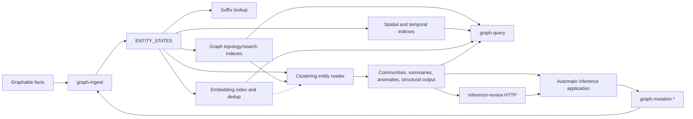

# Graph state, write, projection, and read inventory

**Status:** Frozen evidence inventory with non-binding analysis and recommendation.

**Snapshot date:** 2026-08-03.

**Repository evidence baseline:** `c6ef4541` (`main` at inventory start), before
the #894 and #895 projection retirements. The inventory was committed with #894
so the evidence and the first fix traveled together; its facts remain pinned to
the earlier census baseline.

**Evidence status:** Fable's adversarial
[review disposition](graph-state-read-write-inventory-review.md) reported 64 of
65 citations confirmed; one line range had drifted and no load-bearing claim was
unsupported. #894 and #895 subsequently changed the catalog facts for
`CONTEXT_INDEX` and `STRUCTURAL_INDEX`. This document is not refreshed as program
state changes.

**Canonical program:**
[`graph-state-read-write-program.md`](graph-state-read-write-program.md).

**Scope:** Graph authority, mutation, change delivery, derived state, query paths,
readiness, replay, and rebuild. This document does not approve a target
architecture or itself authorize or prohibit another graph issue fix.

Unless a section explicitly says otherwise, findings are repo-local SemStreams
evidence. Sister-repository observations are point-in-time holdout/adoption notes,
not architecture votes, completeness claims, or a requirement to repeat a
downstream source census before each SemStreams increment. The ten holdouts and
their coordinated migration policy are recorded in the canonical program.

## Terminology used in this inventory

- **Authoritative state:** canonical current shared semantic state in
  `ENTITY_STATES`.
- **Derived state:** reconstructible state computed from authority or another
  declared dependency.
- **Materialized view:** durable derived state maintained to serve a read pattern.
- **Projection owner:** the component responsible for a materialized view's
  convergence and lifecycle.
- **Projection contract:** when referring to `pkg/projection`, the ownership and
  predicate-group contract for writing facts into authoritative state. This is not
  a materialized read view.

## Executive finding

SemStreams is not an event-sourced CQRS system. It is a current-state system with:

1. one authoritative semantic-state KV bucket (`ENTITY_STATES`),
2. request/reply mutation commands handled by its sole writer (`graph-ingest`),
3. KV revisions used as the state-change feed,
4. several independently implemented materialized views, and
5. several overlapping read front doors.

The repository already made this choice deliberately. `ENTITY_STATES` has history
depth 1, ADR-055 rejected turning transition streams into the source of truth, and
ADR-081 explicitly rejected a full CQRS read-model framework. Calling the current
system “CQRS” hides the more useful diagnosis: SemStreams has no uniform contract
for a derived projection's convergence, deletion, dependency change, failure,
readiness, or rebuild.

The concrete result is one declared authority but several different consistency
models:

- graph-index reconciles current truth, retries, repairs, and publishes a revision
  watermark;
- graph-embedding implements a second, more complex two-hop state machine with a
  partial repair taxonomy;
- spatial and temporal indexes replay current truth but do not durably repair
  failed writes;
- spatial does not remove deleted or no-longer-spatial entities;
- alias and suffix mappings lack complete stale-entry reconciliation;
- clustering periodically rebuilds a multi-key partition and tolerates stale
  extras between cycles;
- readiness exists for only some derived producers;
- consumers can bypass the public query coordinator and read graph-ingest or KV
  buckets directly.

This is the evidence base for deciding whether symptom-level fixes should
continue.

## 1. Governing decisions already in force

- **Sole writer:** `graph-ingest` is the only `ENTITY_STATES` writer. There is one
  persistence owner despite many mutation callers
  (`openspec/specs/graph-ingest/spec.md:5`, `graph/kvcatalog.go:67-74`).
- **Current state:** `ENTITY_STATES` has history 1. It is not a retained ledger
  from which authority can be reconstructed (`graph/kvcatalog.go:67-74`).
- **State-change feed:** a successful KV write is the state-change event consumed
  by materialized-view owners
  (`docs/adr/056-authoritative-semantic-state.md:1790-1799`).
- **Transition commands:** transitions remain request/reply so CAS rejection is
  synchronous. Making a stream authoritative was rejected as event sourcing
  (`docs/adr/055-graph-write-intent-taxonomy.md:180-191`).
- **Derived indexes:** disagreement resolves toward `ENTITY_STATES`, normally by
  rebuild or reconciliation (`openspec/specs/graph-index/spec.md:5-11`).
- **No second authority:** product state may be private data, work, cache, or a
  derived view, but not an authoritative mirror of the same predicate group
  (`docs/adr/056-authoritative-semantic-state.md:1486-1502`).
- **No general CQRS framework:** ADR-081 accepted `pkg/graphview` as an in-process
  fan-out view and rejected a general durable read-model framework
  (`docs/adr/081-graph-view-subscription.md:157-178`).
- **Local readiness ownership:** producers publish their own status and consumers
  aggregate only their dependencies; there is no deployment-global required list
  (`graph/readiness/watcher.go:65-70`,
  `docs/adr/088-readiness-is-per-producer-aggregation-is-the-consumers.md`).

These decisions are coherent together. The documented divergence surfaces arise
where individual projection implementations do not all satisfy the consequences
those decisions imply.

## 2. State-store inventory

The KV catalog declares one authoritative bucket and sixteen derived buckets.
Every catalog bucket defaults to history 1 unless its descriptor overrides it
(`graph/kvcatalog.go:46-65`).

- **Authoritative:** `ENTITY_STATES`, owned by graph-ingest.
- **Identity lookup:** `ENTITY_SUFFIX_INDEX`, owned by graph-ingest.
- **Topology/search:** `OUTGOING_INDEX`, `INCOMING_INDEX`, `ALIAS_INDEX`,
  `PREDICATE_INDEX`, `CONTEXT_INDEX`, and `NAME_INDEX`, owned by graph-index.
- **Spatial/temporal:** `SPATIAL_INDEX`, `TEMPORAL_INDEX`, and
  `TEMPORAL_INDEX_REVERSE`, owned by the corresponding index components.
- **Semantic:** `EMBEDDING_INDEX`, `EMBEDDING_DEDUP`, `COMMUNITY_INDEX`,
  `COMMUNITY_SUMMARIES`, `ANOMALY_INDEX`, and `STRUCTURAL_INDEX`, owned by
  graph-embedding or graph-clustering.
- **Operational:** `GRAPH_INGEST_APPLIED_SEQ`, `GRAPH_STATUS`, `OWNER_CLAIMS`,
  `OWNER_PRESENCE`, and `STORAGE_REPORT`, with named subsystem owners.
- **Diagnostic:** `COMPONENT_STATUS`, with shared writers.

Catalog rows: `graph/kvcatalog.go:151-194`.

Catalog ownership is not universally respected at runtime: graph-gateway's
inference review handler writes status updates into graph-clustering-owned
`ANOMALY_INDEX`. This is the only production derived-bucket ownership exception
found in this census (`gateway/graph-gateway/component.go:784-810`,
`graph/inference/http_handlers.go:212-278`).

### Derived artifact roles

`ClassDerived` is an ownership/authority classification, not one operational
contract. Its buckets serve at least four roles:

- **Required query views:** topology/search, spatial, temporal, and community
  partition data whose declared query can be unavailable or misleading when the
  view is unhealthy.
- **Optional enrichment:** embeddings, summaries, anomaly, and structural output
  where some callers can intentionally degrade to a lower capability.
- **Internal accelerator or deduplication state:** suffix and embedding dedup data
  that speed or suppress work but are not themselves the public answer.
- **Reverse bookkeeping:** temporal reverse keys and entity-to-community mappings
  used to maintain or navigate another view.

Obligations must be assigned by capability/output family and role. For example,
`COMMUNITY_SUMMARIES` is intentionally excluded from partition readiness because a
missing summary has a supported statistical fallback. A single readiness rule for
all sixteen buckets would be incorrect.

### What “authoritative” currently contains

`ENTITY_STATES` is not limited to externally observed source facts. It contains a
mixture of:

- Graphable-produced entity state;
- gateway/lifecycle/rule/agent-owned predicate groups;
- inferred hierarchy triples and generated hierarchy container entities;
- referential-integrity stub entities;
- foreign-edge normalization results;
- lifecycle and coordination state;
- other contract-bound semantic projections written back into shared state.

Hierarchy inference can create related authoritative entities before the primary
candidate commits (`processor/graph-ingest/component.go:2485-2494`), and normal
entity creation invokes hierarchy inference before the primary write
(`processor/graph-ingest/component.go:2665-2678`). Referential targets are created
best-effort after the main commit (`processor/graph-ingest/component.go:2734-2743`).

Therefore “authoritative” means canonical current shared semantic state. It does
not mean “original source facts only,” and it does not mean “replayable ledger.”
Any future architecture must keep those meanings separate.

## 3. Authoritative write inventory

### 3.1 Write ingress

- **Graphable stream arrival:** asynchronously decodes, normalizes, and merges by
  predicate under CAS retry. It returns no caller receipt
  (`processor/graph-ingest/component.go:1707-1797`, `:2446-2607`).
- **`entity.create_with_triples`:** atomic create-or-fail with a request/reply
  mutation result (`processor/graph-ingest/mutations.go:48-53`,
  `processor/graph-ingest/component.go:2633-2712`).
- **`entity.update_with_triples`:** must-exist replace-by-predicate with optional
  expected-revision CAS and request/reply result
  (`docs/adr/055-graph-write-intent-taxonomy.md:121-133`).
- **`triple.add` / `add_batch`:** must-exist evidence append with duplicate
  suppression and per-entity CAS. An exact revision is returned only where one
  entity committed (`processor/graph-ingest/component.go:3128-3254`).
- **`triple.remove`:** CAS retraction when a matching entity/predicate exists;
  absent entities and missing predicates are idempotent no-op successes
  (`processor/graph-ingest/mutations.go:532-557`,
  `processor/graph-ingest/component.go:3483-3535`).
- **Bare entity subjects:** `entity.create` is create-or-fail, `entity.update` is
  must-exist, and `entity.delete` is idempotent. These subjects return
  request/reply results (`processor/graph-ingest/mutations.go:42-72`).
- **`pkg/projection.MutationClient`:** contract- and owner-bound facade over
  create, replace-owned, append-evidence, and authoritative reads. It returns a
  `MutationReceipt` (`pkg/projection/mutation_types.go:17-161`,
  `pkg/projection/mutation_client.go:22-27`).
- **In-process graph-ingest methods:** expose `Put`, `Create`, CAS update, CAS
  retry merge, and delete through Go errors and, sometimes, internal revision
  (`processor/graph-ingest/component.go:2436-2444`, `:2887-2991`).

### 3.2 One writer does not mean one write semantic

The sole-writer boundary is real, but its implementation exposes multiple conflict
models:

- last-writer-wins `Put` (`CreateEntity`, `UpdateEntity`);
- atomic create-or-fail (`CreateEntityStrict`);
- CAS-on-condition (`updateEntityAtRevision`);
- CAS-with-retry predicate merge (`MergeEntity`, triple operations);
- per-entity partial success for multi-entity batches;
- best-effort side effects for suffix indexing, hierarchy, referential stubs, and
  foreign edges.

This is partly intentional—the write-intent taxonomy needs different conflict
semantics—but the raw NATS subjects and in-process methods let callers choose at a
lower level than the public intent model. `pkg/projection.MutationClient` is the
closest thing to one write front door, but production binding is narrow: the
built-in ownership service and rule-pack binding are its two bind sites. Raw
subjects remain hard-coded across lifecycle, rules, gated DAG, agentic processors,
research-graph processors, and inference. The graph gateway declares mutation
output capability but does not itself issue those requests.

### 3.3 Repository-local mutation-subject caller census

- **`graph.mutation.triple.add`:** called by rule actions, clustering inference,
  agent-run milestones, agentic tools, agentic-loop graph writing, and
  research-graph publication
  (`processor/rule/triple_mutator.go:17-69`,
  `graph/inference/applier.go:207-281`,
  `agentic/agentrun/nats_reader.go:29-66`,
  `processor/agentic-tools/decide.go:668-713`,
  `processor/agentic-loop/graph_writer.go:25-112`,
  `processor/research-graph-llmwrap/triplepub.go:51-100`).
- **`graph.mutation.triple.add_batch`:** called through MutationClient, agentic
  tools, agentic-loop, and research-graph batch writers
  (`pkg/projection/mutation_client.go:23-25`,
  `processor/agentic-tools/decide.go:678-744`,
  `processor/agentic-loop/graph_writer.go:25-143`,
  `processor/research-graph-llmwrap/triplepub.go:54-122`).
- **`graph.mutation.triple.remove`:** repository production use is the legacy rule
  mutator (`processor/rule/triple_mutator.go:17-124`).
- **`graph.mutation.entity.create`:** no repository production caller exists; the
  E2E client is the only caller found. The gateway merely declares the wildcard
  output surface.
- **`graph.mutation.entity.create_with_triples`:** called through MutationClient,
  lifecycle, agentic tools/loop, and research-graph publication
  (`pkg/projection/mutation_client.go:523-701`,
  `pkg/lifecycle/graph_emit.go:85-229`,
  `processor/agentic-tools/decide.go:756-793`,
  `processor/agentic-loop/graph_writer.go:165-205`,
  `processor/research-graph-llmwrap/triplepub.go:59-180`).
- **`graph.mutation.entity.update`:** no repository production caller exists; the
  E2E client is the only caller found.
- **`graph.mutation.entity.update_with_triples`:** called through MutationClient,
  lifecycle, and gated DAG claims (`pkg/projection/mutation_client.go:703-784`,
  `pkg/lifecycle/graph_emit.go:85-157`, `processor/gated-dag/claim.go:14-106`).
- **`graph.mutation.entity.delete`:** repository production use is lifecycle
  reclamation (`pkg/lifecycle/graph_emit.go:389-421`).

This is a repository-local census, not proof that sister repositories have no raw
callers. Because compatibility is explicitly not required, external callers do not
veto consolidation, but they do define the downstream migration list.

### 3.4 Command outcome is a separate concern

Successful mutation responses can carry the exact authoritative KV revision.
They also distinguish a committed write whose read-back failed and explicitly
forbid retry (`graph/mutation_responses.go:22-66`). The public mutation client adds
`not-committed`, `unknown`, `committed`, and `verified` commit states
(`pkg/projection/mutation_types.go:65-83`).

This is not yet a general request-correlation or idempotency primitive. The active
lifecycle change records that a delivered request can time out and still commit,
and promotes request-scoped idempotency/correlation to
[issue #869](https://github.com/C360Studio/semstreams/issues/869)
(`openspec/changes/lifecycle-create-ownership-proof/proposal.md:176-219`). That
problem belongs to command outcome, not to derived-view convergence.

## 4. Change-carrier inventory

There are four mechanisms currently described as events or changes:

1. **Graphable fact stream.** Graph-ingest consumes retained JetStream messages on
   `entity.>` with `DeliverPolicy=all`. Its two-tier redelivery guard records
   `(entityID, streamName) -> last-applied stream sequence` in memory and in
   `GRAPH_INGEST_APPLIED_SEQ`, and stamps the guard after graph side effects but
   before acknowledging the message
   (`processor/graph-ingest/component.go:501-513`, `:766-773`,
   `processor/graph-ingest/keyed_ingest.go:139-228`).
2. **Authoritative KV revisions.** Every `ENTITY_STATES` write emits a KV watch
   revision. This is the input to the graph index, spatial index, temporal index,
   embedding, rule watchers, lifecycle guards, caches, and other consumers.
3. **Request/reply mutation commands.** These tell graph-ingest to attempt a write
   and may return a commit revision. They are not retained as a command ledger.
4. **`graph.events.*`.** Rule processing publishes graph event payloads through
   either core NATS or JetStream according to its configured output port
   (`graph/events.go:129`, `processor/rule/publisher.go:103-105`). This is not the
   authoritative change feed that materialized graph indexes consume.

The fourth surface is semantically distinct but its name invites callers to treat
it as the graph's change stream. The inventory found no behavior-bearing production
consumer or projection owner using it as authority for rebuild or convergence. It
does have one live producer defect: the graph gateway's anomaly-approval endpoint
publishes relationship triples to `graph.events.relationship.create` through
JetStream. If no stream declares that subject, approval fails at publish; if a
stream does, no production consumer applies the triple. Clustering's automatic
inference path correctly uses `graph.mutation.triple.add`
(`gateway/graph-gateway/component.go:784-806`,
`graph/inference/applier.go:19-92`, `:207-281`). This defect should be tracked
separately from the architecture ruling.

Fact-lane recovery has three binding limits. Resident poison survives only through
the configured consumer `MaxDeliver`; intentionally recreating an input stream
resets its sequence while old guard rows persist, so that stream's guard partition
must also reset; and per-entity serialization is process-local, so ADR-072 requires
one graph-ingest instance. These are recovery/exclusivity requirements, not tuning
details (`openspec/specs/graph-ingest/spec.md:686-702`,
`docs/adr/072-keyed-concurrent-entity-ingest.md:229-241`).

### 4.1 `ENTITY_STATES` watcher and replay consumers

Not every watcher is a durable materialized-view owner. The current consumers fall
into seven roles with different obligations.

#### Durable materialized-view owners

Graph-index, spatial, temporal, and embedding replay current authoritative values
and write durable derived buckets. Their bootstrap, removal, retry, poison,
watermark, readiness, and repair behavior is detailed in section 5.

#### Authority startup validation

Graph-ingest synchronously opens `ENTITY_STATES.WatchAll` to validate the resident
snapshot and build a per-entity poison inventory. Queries remain closed until the
end-of-snapshot marker. Pre-marker watcher loss leaves queries not ready but does
not take the authoritative writer down. On successful bootstrap, graph-ingest
deliberately stops and drains the watcher; it holds no steady-state self-watch.
The snapshot proof depends specifically on bucket history 1, where replay before
the marker contains only the latest resident revision per key
(`processor/graph-ingest/component.go:1306-1408`).

#### Reactive rule consumer

The rule processor opens configured pattern watches only; with no configured
patterns it holds no `ENTITY_STATES` watcher. Each dynamically replaceable watcher
generation tracks its own replay completion and count. Unexpected watcher closure
or startup failure latches sticky degradation for the process, and invalid consumed
state latches reset-required. Dispatch re-reads authoritative state at execution
time. It does not persist a read model or coalesce revisions; a relevant replayed
or live revision can trigger rule evaluation
(`processor/rule/entity_watcher.go:18-51`, `:139-261`, `:1000-1028`).

#### Lifecycle reactive consumer and contract guard

Lifecycle combines one global `WatchAll` contract guard with per-workflow pattern
watches. The guard tracks the highest clean authoritative revision. A pattern
delivery at revision R waits until the guard has validated through R, preventing a
faster selective watcher from overtaking an earlier poisoned value. Unexpected
guard closure or invalid state fails closed; per-workflow watcher closure ends that
watch. It persists no materialized view, performs no coalescing, and intentionally
replays current matching state to new watchers
(`pkg/lifecycle/manager_query.go:234-471`).

#### Ungated reactive nudge

Gated DAG opens a prefix-filtered `ENTITY_STATES` watch and nudges reevaluation for
every replayed or live non-marker entry. It has no bootstrap gate, state decode,
poison classification, readiness publication, or watcher-loss signal; closure
silently ends nudges (`processor/gated-dag/executor.go:369-403`). This is a second
reactive contract, not an implementation of the rule or lifecycle contract.

#### Serving caches

`graph/query.Client` maintains an entity invalidation cache around direct reads;
watcher loss permanently disables the client. The package has no production
constructor in this repository; its only constructors are documentation and tests.
Graph-query's `CommunityCache` maintains two in-memory serving views:
`COMMUNITY_INDEX` controls cache readiness, while `COMMUNITY_SUMMARIES` deliberately
does not because a summary miss degrades to a statistical fallback. Both use
`WatchAll` and apply updates/deletes without a durable repair record
(`processor/graph-query/community_cache.go:17-85`, `:139-218`). `pkg/graphview` is
an accepted adjacent primitive for local fan-out, but its only production
constructor currently serves agentic activity rather than graph state
(`processor/agentic-dispatch/http_activity.go:160`).

#### Ad hoc operational access and transient scans

Message logger exposes caller-selected reads and SSE watches over any existing KV
bucket. It does not validate graph state, publish readiness, repair missed changes,
or define bucket-specific absence semantics; it is an operator/debug surface, not a
product dependency (`service/message_logger_kv_watch.go:1-220`,
`service/message_logger_http.go:463-530`). Full scans used by suffix fallback and
service endpoints are transient reads, not replay consumers.

This classification matters for standardization: authority startup validation,
durable output convergence, reactive at-least-once processing, and local
serving-cache coherence are different contracts. Sharing terminology, status
types, or conformance cases does not imply one watcher runtime for all seven.

## 5. Derived projection inventory

### graph-ingest suffix index

Direct best-effort calls maintain `ENTITY_SUFFIX_INDEX` after authoritative writes.
There is no watermark or repair loop. A miss scans `ENTITY_STATES` and
self-populates, but stale hits are trusted. Maintenance errors are swallowed,
collisions are last-writer-wins, and stale mappings can survive
(`processor/graph-ingest/component.go:3611-3655`,
`processor/graph-ingest/query.go:415-480`).

### graph-index

A raw `ENTITY_STATES.WatchAll` plus execution-time authoritative re-read maintains
six topology/search buckets. Per-entity ordering, retry, a failed set, periodic
repair, a low-watermark, and `GRAPH_STATUS/graph-index` provide the strongest
current convergence contract. Multi-bucket apply remains eventual. `ALIAS_INDEX`
is explicitly outside owner-complete replacement reconciliation, and alias
retirement is manual (`processor/graph-index/component.go:1398-1423`).

### graph-index-spatial

A raw `WatchAll` maintains `SPATIAL_INDEX` with a bootstrap-local query gate but no
failed set, repair loop, source watermark, or `GRAPH_STATUS` key. Failed writes are
logged and forgotten. Delete cleanup is explicitly unimplemented, and losing
coordinates leaves the prior cell intact
(`processor/graph-index-spatial/component.go:708-731`, `:851-855`).

### graph-index-temporal

A raw `WatchAll` maintains `TEMPORAL_INDEX` and its reverse map with a
bootstrap-local query gate but no failed set, repair loop, source watermark, or
`GRAPH_STATUS` key. Forward and reverse writes can drift, cleanup errors are
swallowed, and losing all timestamps leaves the prior bucket intact
(`processor/graph-index-temporal/component.go:724-759`, `:959-1074`).

### graph-embedding

An `ENTITY_STATES.WatchAll` creates durable pending records; a second
`EMBEDDING_INDEX.WatchAll` worker produces terminal values and feeds the vector
cache. Records persist source revision, and the component implements a
low-watermark, failed/stranded maps, partial periodic repair, and
`GRAPH_STATUS/graph-embedding`. This two-hop state machine mixes work queue,
materialized value, terminal state, cache feed, and readiness. Store registration
is not an entity revision, so current code may not re-drive work. As of 2026-08-03,
[PR #893](https://github.com/C360Studio/semstreams/pull/893) is a pending
containment attempt with unresolved startup-order coverage.

### graph-clustering

Periodic full detection writes community, structural, anomaly, and summary output
from current topology and optional embeddings. Sorted input is deterministic, but
each cycle writes a new partition before best-effort pruning the old one. Readers
can see old and new output together, and prune failure leaves stale extras. There
is no clustering `GRAPH_STATUS` envelope
([issue #820](https://github.com/C360Studio/semstreams/issues/820)). Oversized
communities can also make individual writes permanently impossible
([issue #837](https://github.com/C360Studio/semstreams/issues/837),
[issue #855](https://github.com/C360Studio/semstreams/issues/855)).

### `pkg/graphview` design precedent

This primitive uses one watcher to maintain an in-memory current-state map and
coalesced local fan-out. It has a bootstrap gate, fail-closed watcher loss,
re-bootstrap ghost removal, and per-key poison handling. It deliberately is not a
durable projection framework and currently has no production graph-state adopter.

### Projection contract that exists only by convention

Across these components, a dependable materialized view would need all of the
following answers:

- authoritative input and revision space;
- projection key ownership and desired-state function;
- update and removal semantics;
- whether external dependency changes re-drive the projection;
- execution-time re-read versus delivery-snapshot use;
- retryable, permanently excluded, and poison classifications;
- durable repair obligation;
- watermark/readiness publication;
- per-row source provenance where required;
- active-instance exclusivity, fencing, and failover behavior;
- online reconcile versus clean wipe/rebuild procedure;
- query behavior during bootstrap, lag, degradation, and reset.

No shared durable primitive requires those answers. Each component has selected a
different subset.

Catalog ownership and `OWNER_CLAIMS` answer who owns a bucket or authoritative
predicate group, not which runtime instance is active. Owner registration allows a
new process incarnation with the same stable owner ID to replace the persisted
entry (`pkg/ownership/registry.go:284-380`). KV watches fan out; graph-index has no
leader lease, queue group, or fencing token around its six buckets or the shared
`GRAPH_STATUS/graph-index` key. Two instances can therefore process and publish
status concurrently, and repository evidence does not establish safe active/active
convergence. Every durable owner needs either single-active enforcement and
failover or an explicit multi-writer convergence proof.

This applies beyond graph-index. Spatial, temporal, embedding, clustering,
enhancement, and anomaly-review workers use process-local lifecycle guards and
independent fan-out watchers. Embedding replicas can duplicate paid generation;
clustering replicas can overlap whole-partition writes and prunes. NATS
request/reply handlers use ordinary subscriptions rather than queue groups, so
multiple replicas can also execute the same query or mutation request while the
caller accepts only the first reply (`natsclient/request.go:337-385`). The current
safe default is single-active owners. Derived owners can fail over by replaying or
recomputing from preserved authority; graph-ingest failover must preserve authority
and guard state rather than assume fact replay can rebuild it.

## 6. Read-path inventory

- **`graph.ingest.query.*`:** authoritative internal point, batch, prefix, and
  suffix reads over `ENTITY_STATES`, the suffix index, and ingest caches. It uses
  read-after-write invalidation, canonical decode, and a bootstrap gate
  (`processor/graph-ingest/query.go:24-55`).
- **`graph.query.*`:** the public coordinator routes to ingest, graph-index,
  spatial/temporal, embedding, and clustering through handwritten per-handler
  aggregation and fallback (`processor/graph-query/router.go:17-42`).
- **`graph/query` Go client:** opens `ENTITY_STATES`, `SPATIAL_INDEX`, and
  `INCOMING_INDEX` directly. It owns another entity watcher/cache, applies the
  graph-index health gate only to incoming reads, and permanently disables itself
  after watcher loss. It has no production constructor in this repository
  (`graph/query/client.go:147-277`, `:455-592`).
- **Graph gateway:** maps GraphQL/HTTP reads to `graph.query.*`; it declares a
  `graph.mutation.*` output port but does not issue mutation requests. Its mapping
  does not collapse underlying consistency models, and MCP is a placeholder.
- **Graph-query community cache:** watches `COMMUNITY_INDEX` and
  `COMMUNITY_SUMMARIES`; selected misses read storage directly. Partition replay
  controls readiness, while summaries deliberately fall back to statistical
  output. Watcher failures have no durable repair state.
- **Specialized component subjects:** expose individual index, embedding, spatial,
  and temporal buckets or caches with component-specific bootstrap and failure
  rules.
- **Direct internal consumers:** lifecycle, agentic, gated DAG, rules, and services
  choose direct KV, graph-ingest, or graph-query and inherit different contracts.
  Concrete authority bypasses include agent-run, the agentic graph-query tool, and
  clustering (`agentic/agentrun/nats_reader.go:77-129`,
  `processor/agentic-tools/executors/register_graph_query.go:73-111`,
  `processor/graph-clustering/component.go:1138-1166`).
- **Lifecycle gateway:** exposes operator HTTP list/get/watch/history operations
  backed by lifecycle.Manager's direct `ENTITY_STATES` Keys/Get/Watch/History
  access (`gateway/lifecycle-gateway/handlers.go:284-321`,
  `pkg/lifecycle/manager_query.go:27-158`, `:516-551`). On a history-1 bucket,
  `History` cannot provide a retained transition history.
- **Inference HTTP:** graph gateway reads `ANOMALY_INDEX` directly for anomaly
  review and writes review status back through `NATSAnomalyStorage`, despite the
  bucket's graph-clustering ownership
  (`gateway/graph-gateway/component.go:784-810`,
  `graph/inference/http_handlers.go:212-278`).
- **Message logger:** operator/debug HTTP can list or watch any caller-selected KV
  bucket without graph-specific consistency semantics.
- **`/graph/triples`:** scans `ENTITY_STATES` directly, bypassing graph-query
  composition (`service/graph_triples_http.go:162-180`).

There are therefore at least four meaningful graph read strata: authoritative KV,
graph-ingest authoritative RPC, graph-query coordinated RPC, and gateway APIs.
The unused package-level direct client is a fifth available composition point, not
an adopted production path. Lifecycle and operator/debug HTTP add surfaces outside
the graph-query coordinator. `pkg/fusion/fusionnats` is the strongest repository
typed adopter of the public `graph.query.*` layer
(`pkg/fusion/fusionnats/client.go:22-83`).

Graph-query is therefore not only a router. Its community handlers can read an
in-memory partition view, join an independently watched optional summary view, or
fall back to durable storage on selected misses
(`processor/graph-query/community_cache.go:17-218`,
`processor/graph-query/graphrag.go:2028-2047`). The supposedly coordinated front
door itself contains more than one bootstrap and absence contract.

### 6.1 Repository-local reader census for the sixteen derived buckets

This census counts production code in this repository. It deliberately separates
product queries from owner-internal maintenance and optional operator/debug reads.
Sister-repository use must be checked before deletion, although pre-v1 compatibility
is not a requirement.

- **`ENTITY_SUFFIX_INDEX`:** graph-ingest's suffix query is the product reader and
  can fall back to an authority scan (`processor/graph-ingest/query.go:415-544`).
- **`OUTGOING_INDEX`:** graph-index serves outgoing queries; graph-clustering reads
  it directly for topology; graph-query/PathRAG calls the query subject
  (`processor/graph-index/query.go:26-31`,
  `processor/graph-clustering/component.go:1157-1166`,
  `processor/graph-query/pathrag.go:261-266`).
- **`INCOMING_INDEX`:** graph-index serves incoming queries; graph-clustering reads
  it directly; the exported but repository-unused `graph/query.Client` can open it
  (`processor/graph-index/query.go:33-38`,
  `processor/graph-clustering/component.go:1157-1166`,
  `graph/query/client.go:173-175`).
- **`ALIAS_INDEX`:** graph-index serves alias lookup and graph-query uses it during
  entity resolution (`processor/graph-index/query.go:40-45`,
  `processor/graph-query/entity_resolver.go:14-18`).
- **`PREDICATE_INDEX`:** graph-index serves predicate, list, statistics, and
  compound queries; graph-query uses those subjects for summaries and routing
  (`processor/graph-index/query.go:47-73`,
  `processor/graph-query/summary.go:44-110`).
- **`CONTEXT_INDEX`:** no repository production reader exists. The graph-index spec
  says the bucket currently exists only for provenance maintenance
  (`openspec/specs/graph-index/spec.md:90-92`).
- **`NAME_INDEX`:** graph-index's `byName` handler is the production reader and is
  routed through graph-query (`processor/graph-index/query.go:75-80`,
  `processor/graph-query/query.go:611-620`).
- **`SPATIAL_INDEX`:** graph-index-spatial serves bounds/polygon queries; graph-query
  routes bounds queries; the unused direct client can also open it
  (`processor/graph-index-spatial/query.go:23-35`,
  `processor/graph-query/router.go:34-35`, `graph/query/client.go:167-169`).
- **`TEMPORAL_INDEX`:** graph-index-temporal serves range queries and graph-query
  routes them (`processor/graph-index-temporal/query.go:18-23`,
  `processor/graph-query/router.go:34-35`).
- **`TEMPORAL_INDEX_REVERSE`:** owner-internal bookkeeping for temporal cleanup;
  no independent product reader exists.
- **`EMBEDDING_INDEX`:** graph-embedding's worker and similarity/search handlers
  read it; graph-query and graph-clustering consume those query subjects
  (`graph/embedding/worker.go:322-353`,
  `processor/graph-embedding/query.go:20-42`,
  `processor/graph-clustering/similarity.go:20-99`).
- **`EMBEDDING_DEDUP`:** owner-internal content-addressed deduplication state; no
  independent product query exists (`graph/embedding/dedup.go:18-79`).
- **`COMMUNITY_INDEX`:** graph-query maintains its serving cache, and clustering's
  enhancement worker watches it as a trigger
  (`processor/graph-query/community_cache.go:17-85`,
  `graph/clustering/enhancement_worker.go:222-359`).
- **`COMMUNITY_SUMMARIES`:** graph-query joins this optional serving cache into
  community results; misses degrade to statistical output
  (`processor/graph-query/community_cache.go:191-260`).
- **`ANOMALY_INDEX`:** clustering's optional review worker watches it and the graph
  gateway exposes inference-review HTTP reads and review-status writes
  (`processor/graph-clustering/component.go:2293-2342`,
  `gateway/graph-gateway/component.go:784-810`,
  `graph/inference/http_handlers.go:212-278`). The gateway write is an implemented
  catalog-ownership exception.
- **`STRUCTURAL_INDEX`:** no repository production query exists; graph-clustering
  writes it and the E2E harness inspects it
  (`processor/graph-clustering/doc.go:118-124`).

Two adjacent deletion candidates are not part of the sixteen derived buckets:
`COMPONENT_STATUS` has many lifecycle writers and no production reader by catalog
contract (`graph/kvcatalog.go:135-148`), and the exported `graph/query.Client` has
no production constructor in this repository. Message logger can inspect any named
bucket, but an optional debug endpoint is not by itself a product-retention reason.

### 6.2 Derived capability dependency and feedback graph

The sixteen buckets are not independent deletion units:

Graph-clustering is a second-order projection: it polls current entities, reads
`OUTGOING_INDEX` and `INCOMING_INDEX` directly, and optionally calls
`graph.embedding.query.similar`. Stale or unavailable graph-index/embedding input
therefore propagates into communities and anomaly output
(`processor/graph-clustering/component.go:1157-1166`, `:1316-1458`,
`processor/graph-clustering/similarity.go:20-110`). The deletion test must evaluate
capability families and downstream effects, not sixteen isolated buckets.

The graph is cyclic, not a DAG. Clustering detection can auto-apply semantic gaps
through `MutationRelationshipApplier`; human approval is intended to perform the
same authoritative effect. The resulting `ENTITY_STATES` revision re-drives
indexes, embeddings, and clustering
(`graph/inference/detector.go:218-239`,
`graph/inference/applier.go:207-281`). Anomaly projection and inference application
must therefore be treated as separate capabilities. Recomputing derived anomalies
must not silently authorize graph writes. Today an auto-apply failure is logged but
does not fail the detection run (`graph/inference/detector.go:218-224`), so detection
completion is not authoritative application evidence.

The GraphQL gateway determines an operation and then maps it through handwritten
logic (`gateway/graph-gateway/component.go:832-951`). Its MCP endpoint is currently
a placeholder rather than an implemented equivalent query front door
(`gateway/graph-gateway/component.go:1905-1925`). The declared gateway protocols
therefore do not yet offer interchangeable access to one graph-read contract.
`docs/concepts/11-query-access.md`, `docs/concepts/09-graphrag-pattern.md`,
`docs/concepts/10-pathrag-pattern.md`, and the `query-pattern` skill currently claim
MCP wraps GraphQL and exposes GraphRAG/PathRAG; those claims are ahead of the code.

### 6.3 Read-your-writes

The existing intended contract is:

1. obtain `kv_revision` from the successful authoritative mutation;
2. for an authoritative read, read graph-ingest/`ENTITY_STATES` directly;
3. for a derived read, compare that revision with the relevant producer's
   `GRAPH_STATUS.indexed_revision`.

This comparison is explicitly documented in `graph/mutation_responses.go:147-157`
and tested for graph-index. It is not packaged as one “wait until projection X has
covered revision R” operation, and not every projection publishes a comparable
revision. Callers must know the producer key and whether its status uses revision
lag or another unit.

## 7. Readiness, failure, and rebuild inventory

### 7.1 Readiness coverage

The shared status keys currently name graph-index, graph-embedding, graph-ingest,
and rule (`graph/readiness/watcher.go:39-63`). Of the durable derived graph owners,
only graph-index and graph-embedding publish a revision-comparable projection
status.

Spatial, temporal, clustering, suffix, and community-summary correctness therefore
cannot participate in the same read-your-writes or deployment health proof. Some
have local bootstrap flags, but a caller outside the component cannot compose them.

### 7.2 Rebuild boundaries

The following statements are supported:

- A **cleanly emptied derived bucket** can generally be repopulated from current
  `ENTITY_STATES` if its dependencies are present and the projection algorithm
  succeeds.
- graph-index and embedding also attempt online reconciliation and repair without
  requiring a new entity revision.
- clustering periodically recomputes from current inputs and prunes stale output
  best-effort.

The following stronger statements are not supported:

- Authoritative `ENTITY_STATES` can be rebuilt from its own retained history. It
  cannot; history is 1.
- The Graphable fact stream is an authoritative recovery ledger. It is not:
  retention may evict old facts, request/reply mutations never pass through it,
  and a retained `GRAPH_INGEST_APPLIED_SEQ` guard would suppress historical facts
  replayed into an emptied `ENTITY_STATES`. Restoring authority from the fact lane
  therefore needs a separately designed reset/replay operation and cannot recover
  mutation-only state (`docs/adr/072-keyed-concurrent-entity-ingest.md:155-231`).
- Every derived bucket converges online from arbitrary stale state. Spatial does
  not remove stale membership, temporal can lose its reverse map, aliases are not
  owner-complete, and suffix maintenance is best-effort.
- Every relevant dependency change emits a re-drive trigger. Current embedding
  code has no authoritative-state revision for store registration; issue
  [#875](https://github.com/C360Studio/semstreams/issues/875) records the resulting
  redrive gap. As of 2026-08-03,
  [PR #893](https://github.com/C360Studio/semstreams/pull/893) is a pending
  containment attempt and its startup-order coverage remains unresolved.
- `ready` means every answer is current. ADR-084 intentionally separates health
  from ordinary lag, and some producers publish no status at all
  (`docs/adr/084-readiness-licenses-health-not-absence.md`).

### 7.3 Failure atomicity

The authoritative entity write is atomic only for one entity KV value. Related
hierarchy/stub/foreign-edge writes can commit before or after it. Derived indexes
span multiple KV keys and buckets and are eventually reconciled, where a reconciler
exists. Community partitions and temporal forward/reverse mappings are explicitly
multi-key. The architecture should describe this as convergence, not transaction
atomicity.

Current entity deletion calls NATS KV `Delete`, which removes the live value and
emits a delete marker to watchers; it is not a `Purge`. Asynchronous cleanup is
specific to each component
(`processor/graph-ingest/component.go:2994-3028`). There is no
implemented graph-wide referential refusal, cascade, or transactional projection
cleanup policy. ADR-068 (`docs/adr/068-graph-retention-deletion-lifecycle.md`)
discusses a broader target, but the current graph-retention spec
(`openspec/specs/graph-retention/spec.md`) explicitly keeps tombstones,
referential deletion, and GC outside its present scope. The implemented delete
contract must not be inferred from that target ADR. `DeleteEntity` also does not
delete content referenced by `EntityState.StorageRef`, so deleting a content-bearing
entity can orphan its ObjectStore payload (`graph/types.go:33-36`,
`processor/graph-ingest/component.go:2994-3028`).

## 8. Issue-queue snapshot as of 2026-08-03

The open issue queue clusters around missing primitives rather than isolated bugs:

- **Command outcome/correlation:**
  [#861](https://github.com/C360Studio/semstreams/issues/861),
  [#869](https://github.com/C360Studio/semstreams/issues/869),
  [#870](https://github.com/C360Studio/semstreams/issues/870),
  [#871](https://github.com/C360Studio/semstreams/issues/871), and
  [#874](https://github.com/C360Studio/semstreams/issues/874).
- **Authoritative revision semantics:**
  [#681](https://github.com/C360Studio/semstreams/issues/681),
  [#851](https://github.com/C360Studio/semstreams/issues/851), and
  [#892](https://github.com/C360Studio/semstreams/issues/892).
- **Projection dependency, redrive, and failure state:**
  [#875](https://github.com/C360Studio/semstreams/issues/875),
  [#881](https://github.com/C360Studio/semstreams/issues/881),
  [#887](https://github.com/C360Studio/semstreams/issues/887), and
  [PR #893](https://github.com/C360Studio/semstreams/pull/893).
- **Projection readiness and convergence:**
  [#795](https://github.com/C360Studio/semstreams/issues/795),
  [#820](https://github.com/C360Studio/semstreams/issues/820), and
  [#868](https://github.com/C360Studio/semstreams/issues/868).
- **Query front-door and wire-shape drift:**
  [#784](https://github.com/C360Studio/semstreams/issues/784),
  [#785](https://github.com/C360Studio/semstreams/issues/785),
  [#786](https://github.com/C360Studio/semstreams/issues/786),
  [#819](https://github.com/C360Studio/semstreams/issues/819),
  [#822](https://github.com/C360Studio/semstreams/issues/822),
  [#883](https://github.com/C360Studio/semstreams/issues/883),
  [#884](https://github.com/C360Studio/semstreams/issues/884),
  [#885](https://github.com/C360Studio/semstreams/issues/885), and
  [#886](https://github.com/C360Studio/semstreams/issues/886).
- **Bounded projection values and partial writes:**
  [#837](https://github.com/C360Studio/semstreams/issues/837),
  [#839](https://github.com/C360Studio/semstreams/issues/839),
  [#855](https://github.com/C360Studio/semstreams/issues/855), and
  [#857](https://github.com/C360Studio/semstreams/issues/857).
- **Stale caches/indexes:**
  [#672](https://github.com/C360Studio/semstreams/issues/672) and the spatial,
  temporal, and alias findings above.
- **E2E inability to prove graph correctness:**
  [#766](https://github.com/C360Studio/semstreams/issues/766),
  [#769](https://github.com/C360Studio/semstreams/issues/769),
  [#811](https://github.com/C360Studio/semstreams/issues/811),
  [#830](https://github.com/C360Studio/semstreams/issues/830),
  [#844](https://github.com/C360Studio/semstreams/issues/844), and
  [#888](https://github.com/C360Studio/semstreams/issues/888).

Continuing to fix these one at a time risks encoding a different answer in each
package.

## 9. Adopter seam inventory

### External component author writing semantic state

- **What must an adopter know today?** The difference between Graphable birth,
  create-with-triples, replace-owned, append-evidence, CAS transition, owner tokens,
  request retry classes, commit-unknown, and authoritative verification.
- **What happens if they do nothing?** A pure Graphable producer gets merge
  semantics. A component that needs later writes must choose or bind another API.
- **Where do they find out?** ADR-055/056, projection-mutation-client spec, raw
  request types, and component examples—not one entry point.
- **What should they have to know?** Their entity contract and write intent. They
  should not choose a transport subject or independently implement outcome proof.

### Remote/API graph consumer

- **What must they know today?** The gateway's GraphQL mapping, which fields are
  authoritative or derived, and that MCP is not an equivalent implemented path.
- **What happens if they do nothing?** GraphQL is the de facto remote read default,
  but its response does not expose one uniform revision/readiness contract.
- **Where do they find out?** Graph gateway schema and graph-query documentation.
- **What should they have to know?** Query intent and, only when required, a
  requested consistency level. Bucket names and internal NATS subjects should not
  be part of the remote contract.

### Embedded Go graph consumer

- **What must they know today?** Whether to use `graph/query.Client`,
  `graph.query.*`, `graph.ingest.query.*`, or direct KV; which results are derived;
  which readiness key applies; and the client's watcher-loss lifecycle.
- **What happens if they do nothing?** There is no declared default. Existing
  components choose different strata and therefore different failure semantics.
- **Where do they find out?** Query-pattern guidance, package documentation,
  readiness ADRs, and individual component examples.
- **What should they have to know?** A typed query intent and optional consistency
  requirement. The framework should choose authoritative versus materialized
  storage and own watcher recovery.

### Internal owner adding a derived graph capability

- **What must an adopter know today?** All of WatchAll bootstrap, tombstones,
  coalescing, revision watermarks, execution-time re-read, CAS layout, stale-key
  cleanup, retry/repair, poison, readiness, and rebuild.
- **What happens if they do nothing?** The easy implementation appears green after
  bootstrap but can permanently drift after one failed write, deletion, removed
  source field, or dependency lifecycle change.
- **Where do they find out?** By studying graph-index and embedding internals. There
  is no declared adopter seam.
- **What should they have to know?** The capability role, desired-state function,
  output family, and external dependencies. Conformance requirements should follow
  the role. This does not presume that the framework owns one runtime for every
  watcher.

### Deployment operator

- **What must they know today?** Graph-ingest must be single-instance; other
  durable owners have no leader election or active/active proof; input-stream
  recreation requires redelivery-guard coordination; rebuild and readiness differ
  by component.
- **What happens if they do nothing?** Horizontal replicas can duplicate paid work,
  race partition pruning/status, or execute the same request. A recreated stream
  can have early facts silently classified as stale.
- **Where do they find out?** ADR-072 and component internals, not one deployment
  contract.
- **What should they have to know?** Declared replica posture, one failover model,
  and one capability-scoped rebuild/proof operation.

### Human inference reviewer

- **What must they know today?** Review POSTs rewrite clustering-owned anomaly state,
  and approval publishes through a lane with no mutation consumer.
- **What happens if they do nothing?** “Approved” need not mean the relationship
  reached authoritative graph state.
- **Where do they find out?** Only the gateway and inference implementation.
- **What should they have to know?** A review outcome and an authoritative mutation
  receipt; storage ownership and event subjects should remain internal.

### Naming problem

`pkg/projection` means authoritative semantic write contracts and mutation receipts.
“Projection” elsewhere means a derived read model. An adopter cannot infer which
side of the authority boundary a “projection” API is on. This terminology should
be resolved before adding another exported abstraction.

## 10. Measurable premises for the architecture decision

Any proposal should be checked against these repository-derived facts:

1. One authoritative bucket and sixteen declared derived buckets exist today.
2. Four durable view owners independently implement `ENTITY_STATES` replay
   semantics: graph-index, spatial, temporal, and embedding. Rule and lifecycle add
   independent reactive replay/readiness implementations; gated DAG adds an
   ungated nudge watch; graph-ingest adds snapshot-only authority validation; and
   the unused direct query client adds an entity-cache watcher. The community cache
   separately watches `COMMUNITY_INDEX` and `COMMUNITY_SUMMARIES`.
3. Only two durable derived owners publish revision-comparable readiness.
4. `ENTITY_STATES` history is exactly 1.
5. Graphable fact catch-up has a separate JetStream replay/idempotency contract
   backed by `GRAPH_INGEST_APPLIED_SEQ`; it is not an authority rebuild ledger.
6. Mutation callers hard-code both internal authoritative read subjects and raw
   mutation subjects across multiple packages. Bare `entity.create` and
   `entity.update` have no repository production callers.
7. A mutation receipt can identify an exact committed revision, but no common API
   waits for a named projection to cover it.
8. At least three derived implementations can retain stale rows without a new
   authoritative change: spatial, alias, and temporal; suffix can retain or return
   stale last-writer mappings.
9. Current embedding code and issue
   [#875](https://github.com/C360Studio/semstreams/issues/875) show that a
   projection dependency can change without a source-state revision to trigger
   reconciliation. As of 2026-08-03, PR #893 is a pending containment attempt with
   unresolved startup-order coverage.
10. `CONTEXT_INDEX` and `STRUCTURAL_INDEX` have no repository production query;
    `COMPONENT_STATUS` has no production reader; `graph/query.Client` has no
    production constructor.
11. Graph-clustering is a second-order projection over authoritative entities,
    graph-index topology, and optional embedding queries.
12. Catalog ownership controls which component should create and write a bucket,
   but the catalog seam does not authenticate runtime caller identity
   (`graph/kvcatalog.go:20-28`).
13. Ownership registration does not elect or fence one active runtime instance;
    graph-index has no repository-proven active/active convergence contract.
14. Anomaly inference can write through canonical mutation back into authority,
    making the projection dependency graph cyclic; detection success does not prove
    application success.

## 11. Non-binding decision analysis and recommendation

This inventory exposes three strategy options and one cross-cutting deletion test:

### A. Continue package-local repair

Keep every implementation independent and fix each issue in place. This has the
smallest immediate diffs and the highest probability of preserving divergent
contracts. The issue queue is evidence that this option is already failing.

### B. Adopt event-sourced CQRS

Create a durable command/event ledger and make `ENTITY_STATES` a rebuildable
projection of it. This supplies correlation and replay but replaces the accepted KV
twofer/current-state architecture, changes retention and operational recovery, and
adds substantial machinery. Nothing in the inventory demonstrates a need strong
enough to justify that change.

### C. Keep authoritative current state and standardize materialized views

Retain graph-ingest + `ENTITY_STATES` as the source of current truth. Define
role-specific conformance requirements for required query views, optional
enrichment, internal accelerators, reverse bookkeeping, reactive consumers, and
serving caches. Cover desired state, deletion, dependency triggers, retry/repair,
revision coverage, readiness, and clean rebuild only where the role requires them.
Begin with declarations, shared status vocabulary, and contract tests rather than
a reusable watcher runtime. A general runtime would reopen the framework rejected
by ADR-081 and requires its own evidence and decision. Delete derived capabilities
that cannot justify their operational cost. This matches the accepted architecture
without calling it a general CQRS framework.

### Cross-cutting projection deletion test

Delete indexes/projections whose query value does not justify convergence cost and
compute directly from current entity state. This minimizes moving parts but cannot
serve every topology, spatial, semantic, or clustering workload efficiently. Apply
this as a per-projection deletion test under any strategy, especially option C.

The inventory supports **C with an aggressive cross-cutting deletion test**. It
does not support a full CQRS framework or event sourcing.

## 12. Questions for owner decision

Concrete proposed defaults, deletion candidates, sequencing, and override points
are drafted in
[`graph-state-read-write-decision.md`](graph-state-read-write-decision.md). The
questions below remain the owner-controlled rulings.

1. Confirm that `ENTITY_STATES` remains authoritative **current semantic state**,
   not a future event-sourced projection.
2. Classify each derived capability as required query view, optional enrichment,
   internal accelerator/dedup state, or reverse bookkeeping; define deletion,
   dependency-change, repair, readiness, and rebuild obligations for each role.
3. Decide which derived capability families survive that cost test; do not score
   bookkeeping buckets independently from the view they support.
4. Declare adopter-specific read defaults: one remote/API contract, one embedded Go
   contract, and an internal owner contract. Classify remaining subjects/clients as
   internal adapters or retire them. Pre-v1 compatibility is not a constraint.
5. Separate command correlation/idempotency
   ([issue #869](https://github.com/C360Studio/semstreams/issues/869)) from
   projection visibility; both may use revisions, but they answer different
   questions.
6. Decide whether every surviving derived query surface must support
   “at least authoritative revision R,” or explicitly declare that it cannot.
7. Rename or split the two meanings of “projection” before exporting more surface.
8. Define the clean rebuild operation and operator proof for authoritative versus
   derived state separately.
9. Choose an instance model for each surviving durable owner: single-active with
   fencing/failover, or explicitly proven active/active convergence. The default
   should be single-active until a multi-writer proof exists.
10. Separate side-effect-free anomaly recompute from effectful inference
    application, and define idempotency, loop bounds, and authoritative outcome
    evidence for the latter.

Until these are decided, fixes like PR #893 should be evaluated as containment for
a known architecture gap, not as proof that the graph read/write foundation is
settled. Whether work pauses while the owner decides is itself an owner decision,
not an approval granted by this inventory.
