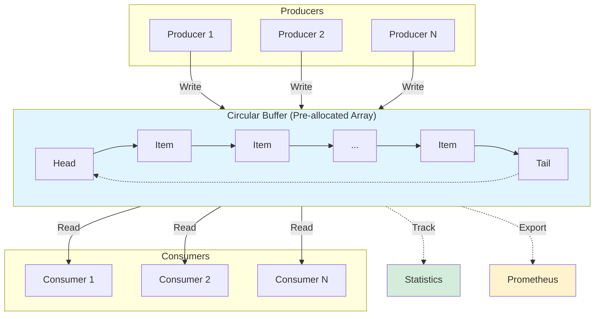
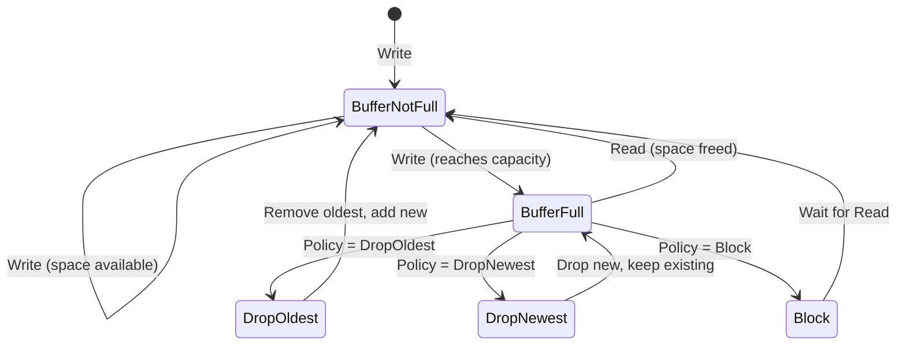

# Buffer Package

A high-performance, thread-safe buffer implementation for Go with configurable overflow policies, built-in statistics, and optional Prometheus metrics integration.

## Features

- 🚀 **High Performance**: Lock-free operations where possible, optimized for throughput
- 📊 **Always Observable**: Statistics always enabled (never operate in the dark)
- 📈 **Prometheus Ready**: Optional metrics integration for production monitoring
- 🔄 **Flexible Overflow**: DropOldest, DropNewest, or Block policies
- 🎯 **Type-Safe**: Full generic support for any item type
- 🧩 **Functional Options**: Clean, composable configuration API
- 🔒 **Thread-Safe**: Safe for concurrent producers and consumers

## Installation

```go
import "github.com/c360/semstreams/pkg/buffer"
```

## Quick Start

### Basic Usage

```go
// Create a circular buffer with capacity 1000 (stats always enabled)
buf := buffer.NewCircularBuffer[int](1000)

// Write items
err := buf.Write(42)

// Read items
item, ok := buf.Read()

// Check buffer state
size := buf.Size()
isFull := buf.IsFull()
```

### With Overflow Policy

```go
// Buffer that drops oldest items when full
buf := buffer.NewCircularBuffer[string](100,
    buffer.WithOverflowPolicy[string](buffer.DropOldest),
)

// Buffer that drops newest items when full
buf := buffer.NewCircularBuffer[[]byte](100,
    buffer.WithOverflowPolicy[[]byte](buffer.DropNewest),
)

// Buffer that blocks when full
buf := buffer.NewCircularBuffer[*Event](100,
    buffer.WithOverflowPolicy[*Event](buffer.Block),
)
```

### With Prometheus Metrics

```go
import "github.com/c360/semstreams/pkg/metric"

// Create metrics registry
registry := metric.NewMetricsRegistry()

// Create buffer with metrics export
buf := buffer.NewCircularBuffer[[]byte](5000,
    buffer.WithOverflowPolicy[[]byte](buffer.DropOldest),
    buffer.WithMetrics[[]byte](registry, "network_buffer"),
)

// Metrics automatically exported:
// - semstreams_buffer_writes_total{component="network_buffer"}
// - semstreams_buffer_drops_total{component="network_buffer"}
// - semstreams_buffer_utilization{component="network_buffer"}
// - etc.
```

### With Drop Callback

```go
// Get notified when items are dropped
buf := buffer.NewCircularBuffer[*Message](1000,
    buffer.WithOverflowPolicy[*Message](buffer.DropOldest),
    buffer.WithDropCallback[*Message](func(msg *Message) {
        log.Printf("Dropped message: %s", msg.ID)
        metrics.DroppedMessages.Inc()
    }),
)
```

## Overflow Policies

### DropOldest
Removes the oldest item to make room for new items when buffer is full.
```go
buffer.WithOverflowPolicy[T](buffer.DropOldest)
```
**Use Case**: When newest data is more important (e.g., real-time telemetry)

### DropNewest  
Drops incoming items when buffer is full.
```go
buffer.WithOverflowPolicy[T](buffer.DropNewest)
```
**Use Case**: When preserving order is critical (e.g., audit logs)

### Block
Write operations block until space is available.
```go
buffer.WithOverflowPolicy[T](buffer.Block)
```
**Use Case**: When no data loss is acceptable (e.g., transaction processing)

#### Block Policy with Timeout

```go
buf := buffer.NewCircularBuffer[T](100,
    buffer.WithOverflowPolicy[T](buffer.Block),
)

// Write with timeout
err := buf.WriteWithTimeout(item, 5*time.Second)

// Write with context
ctx, cancel := context.WithTimeout(context.Background(), 10*time.Second)
err := buf.WriteWithContext(ctx, item)
```

## Functional Options

The buffer package uses functional options for clean, composable configuration:

### WithOverflowPolicy
Set the overflow behavior (default: DropOldest):
```go
buffer.WithOverflowPolicy[T](buffer.DropOldest)
```

### WithMetrics
Enable Prometheus metrics export:
```go
buffer.WithMetrics[T](registry, "component_name")
```

### WithDropCallback
Set a callback for when items are dropped:
```go
buffer.WithDropCallback[T](func(item T) {
    // Handle dropped item
})
```

## API Reference

### Buffer Interface

```go
type Buffer[T any] interface {
    Write(item T) error              // Add item to buffer
    Read() (T, bool)                 // Remove and return oldest item
    ReadBatch(max int) []T           // Remove up to max items
    Peek() (T, bool)                 // View oldest without removing
    Size() int                       // Current number of items
    Capacity() int                   // Maximum capacity
    IsFull() bool                    // Check if at capacity
    IsEmpty() bool                   // Check if empty
    Clear()                          // Remove all items
    Stats() *Statistics              // Buffer statistics (never nil)
    Close() error                    // Shutdown buffer
}
```

### Statistics

Statistics are **always** collected (not optional) for observability:

```go
stats := buf.Stats()

// Available metrics:
stats.Writes()            // Total write operations
stats.Reads()             // Total read operations
stats.Drops()             // Total items dropped
stats.Overflows()         // Total overflow events
stats.Throughput()        // Writes per second
stats.ReadThroughput()    // Reads per second
stats.DropRate()          // Drop percentage (0.0 to 1.0)
stats.Utilization(cap)    // Buffer usage (0.0 to 1.0)
```

## Prometheus Metrics

When enabled via `WithMetrics()`, the following metrics are exported:

| Metric | Type | Description |
|--------|------|-------------|
| `semstreams_buffer_writes_total` | Counter | Total write operations |
| `semstreams_buffer_reads_total` | Counter | Total read operations |
| `semstreams_buffer_peeks_total` | Counter | Total peek operations |
| `semstreams_buffer_overflows_total` | Counter | Total overflow events |
| `semstreams_buffer_drops_total` | Counter | Total items dropped |
| `semstreams_buffer_size` | Gauge | Current items in buffer |
| `semstreams_buffer_utilization` | Gauge | Buffer usage (0-1) |

All metrics include a `component` label for identifying different buffer instances.

## Performance

Benchmark results on MacBook Pro M1:

```text
BenchmarkWrite-12                12,358,087     97.05 ns/op
BenchmarkRead-12                 17,301,534     69.31 ns/op
BenchmarkWriteRead-12             8,407,672    142.4 ns/op
BenchmarkBatchRead-12             3,430,456    349.5 ns/op
BenchmarkConcurrentWrite-12       4,287,906    279.8 ns/op
BenchmarkConcurrentMixed-12       3,015,612    397.3 ns/op
```

### Performance Characteristics

- **Write**: ~97ns per operation
- **Read**: ~69ns per operation  
- **Batch Read**: Efficient bulk operations
- **Metrics Overhead**: ~5% when enabled, zero when disabled
- **Stats Overhead**: Negligible (atomic operations)
- **Memory**: Pre-allocated circular buffer, no dynamic allocations

## Use Cases

### High-Throughput Network Input

```go
func setupNetworkBuffer(registry *metric.MetricsRegistry) buffer.Buffer[[]byte] {
    return buffer.NewCircularBuffer[[]byte](10000,
        buffer.WithOverflowPolicy[[]byte](buffer.DropOldest),
        buffer.WithMetrics[[]byte](registry, "udp_input"),
        buffer.WithDropCallback[[]byte](func(packet []byte) {
            log.Printf("Dropped packet: %d bytes", len(packet))
        }),
    )
}
```

### Rate-Limited Processing

```go
func processWithRateLimit(buf buffer.Buffer[*Task]) {
    ticker := time.NewTicker(100 * time.Millisecond)
    defer ticker.Stop()
    
    for range ticker.C {
        // Process batch every 100ms
        batch := buf.ReadBatch(10)
        for _, task := range batch {
            processTask(task)
        }
    }
}
```

### Producer-Consumer Pattern

```go
func producer(buf buffer.Buffer[*Event]) {
    for event := range eventStream {
        if err := buf.Write(event); err != nil {
            log.Printf("Buffer full: %v", err)
        }
    }
}

func consumer(buf buffer.Buffer[*Event]) {
    for {
        if event, ok := buf.Read(); ok {
            handleEvent(event)
        } else {
            time.Sleep(10 * time.Millisecond)
        }
    }
}
```

## Architecture

### Observability: Dual Tracking Pattern

The buffer package tracks operations through two independent systems:

```mermaid
flowchart LR
    A[Buffer Operation] --> B[Statistics]
    A --> C[Metrics]

    B --> D[Atomic Counters]
    B --> E[Computed Values]

    C --> F[Prometheus Counters]
    C --> G[Prometheus Gauges]

    D --> H[buf.Stats API]
    E --> H

    F --> I[/metrics endpoint]
    G --> I

    style A fill:#e1f5ff
    style B fill:#d4edda
    style C fill:#fff3cd
    style H fill:#d4edda
    style I fill:#fff3cd
```

**Why Track Twice?**

Both Statistics and Metrics independently track operations, which appears redundant but serves distinct purposes:

| Aspect | Statistics (Always On) | Metrics (Optional) |
|--------|------------------------|-------------------|
| **Purpose** | Local debugging & programmatic access | Time-series monitoring & dashboards |
| **Dependency** | None (atomic operations) | Prometheus registry |
| **Computed Values** | Throughput, drop rate, utilization | Raw counters/gauges only |
| **Access** | `buf.Stats()` API | `/metrics` HTTP endpoint |
| **Overhead** | ~50ns/op | ~50ns/op (when enabled) |
| **Use Case** | Tests, debugging, local monitoring | Production dashboards, alerting |

**Performance Trade-off:**
- Dual tracking overhead: **~5% per operation** when metrics enabled
- At 100k ops/sec: **0.5-1% total overhead**
- Negligible cost for comprehensive observability

**Alternative Considered:** Reading Statistics from Prometheus metrics to avoid duplication.

**Rejected because:**
- Creates Prometheus dependency for basic stats
- 10x slower (reading from Prometheus vs atomic operations)
- Breaks Statistics when metrics disabled
- Violates separation of concerns

### Data Flow Architecture



### Overflow Policy Behavior



### Architecture Decisions

#### Why Stats Are Always On

Statistics collection is mandatory because:
- **Observability is critical** for understanding buffer behavior
- **Negligible overhead** (atomic operations ~50ns)
- **Drop rates and overflow metrics** inform capacity planning
- **Throughput metrics** help identify bottlenecks
- **No external dependencies** required for basic monitoring

#### Why Functional Options

We chose functional options over struct-based configuration because:
- **More idiomatic Go** pattern
- **Composable and extensible** - easy to add features
- **Clear intent** with named functions
- **Capacity as required parameter** makes API clearer
- **Backward compatible** when adding new options

#### Why Circular Buffer

Circular buffers provide:
- **O(1) operations** for write and read
- **Predictable memory** usage (pre-allocated)
- **Zero allocations** during operation
- **Cache-friendly** memory access patterns
- **Lock-free reads** for size checks

## Thread Safety

All buffer operations are thread-safe:
- Multiple producers can write concurrently
- Multiple consumers can read concurrently
- Statistics use atomic operations
- Condition variables for Block policy

## Examples

### UDP Packet Buffer

```go
func setupUDPBuffer(registry *metric.MetricsRegistry) buffer.Buffer[[]byte] {
    // High-capacity buffer for UDP packets with monitoring
    return buffer.NewCircularBuffer[[]byte](5000,
        buffer.WithOverflowPolicy[[]byte](buffer.DropOldest),
        buffer.WithMetrics[[]byte](registry, "udp_receiver"),
        buffer.WithDropCallback[[]byte](func(packet []byte) {
            atomic.AddInt64(&droppedPackets, 1)
        }),
    )
}
```

### Event Processing Pipeline

```go
func setupEventPipeline(ctx context.Context, registry *metric.MetricsRegistry) {
    // Buffer between event source and processor
    eventBuffer := buffer.NewCircularBuffer[*Event](1000,
        buffer.WithOverflowPolicy[*Event](buffer.Block),
        buffer.WithMetrics[*Event](registry, "event_pipeline"),
    )
    
    // Producer
    go func() {
        for event := range eventSource {
            ctx, cancel := context.WithTimeout(ctx, 100*time.Millisecond)
            if err := eventBuffer.WriteWithContext(ctx, event); err != nil {
                log.Printf("Failed to buffer event: %v", err)
            }
            cancel()
        }
    }()
    
    // Consumer
    go func() {
        for {
            select {
            case <-ctx.Done():
                return
            default:
                if event, ok := eventBuffer.Read(); ok {
                    processEvent(event)
                }
            }
        }
    }()
}
```

## Contributing

When implementing new buffer types:
1. Statistics must always be initialized
2. Follow functional options pattern
3. Support optional Prometheus metrics
4. Maintain thread safety
5. Include comprehensive tests with race detection
6. Benchmark performance characteristics

## License

See LICENSE file in repository root.